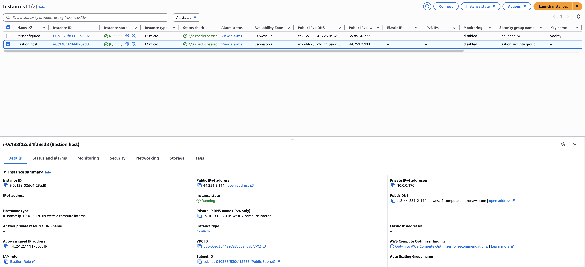
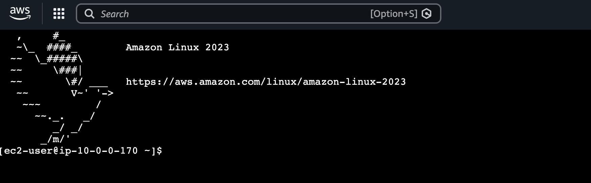
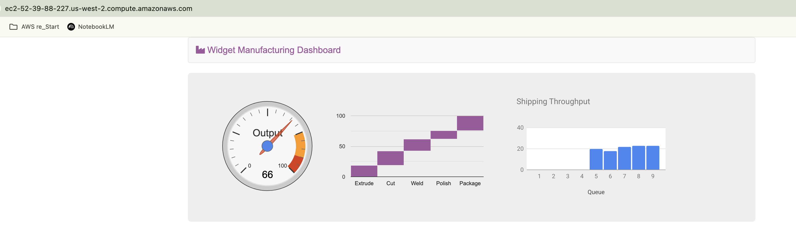
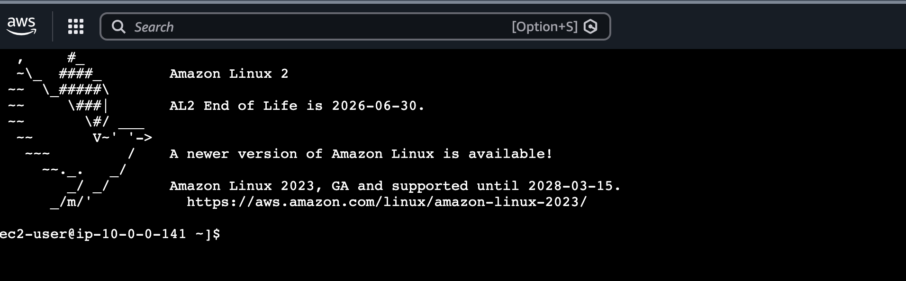
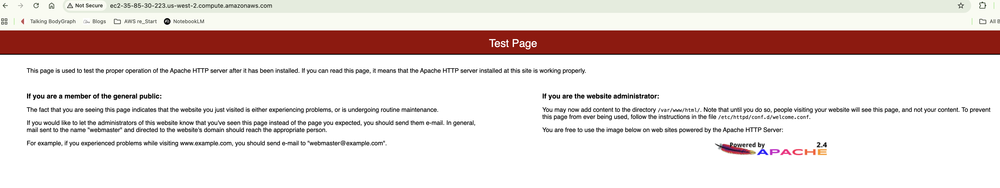

# ☁️ AWS re/Start Lab: Task 1 Log
**Date:** 22 March 2026  
**Lab Title:** Secure Multi-Tier Deployment with EC2  
**Task:** Provisioning the Bastion Host (Gateway)

---

## 🏗️ 1. Infrastructure Configuration Details
In this task, I launched a virtual server (EC2) to serve as a **Bastion Host**. This instance acts as a secure "Jump Box" allowing me to reach internal infrastructure that is not exposed to the internet.

| Setting | Selection | Reasoning (The "Why") |
| :--- | :--- | :--- |
| **Name** | `Bastion host` | **Organization:** Using tags to identify the gateway at a glance. |
| **AMI** | `Amazon Linux 2` | **Software:** Provides a stable environment with AWS CLI pre-installed. |
| **Instance Type** | `t3.micro` | **Resources:** Low-cost, burstable performance ideal for admin tasks. |
| **Key Pair** | `Proceed without` | **Access:** Using **EC2 Instance Connect** for browser-based, keyless SSH. |
| **VPC** | `Lab VPC` | **Networking:** Isolating the lab resources in a dedicated virtual network. |
| **Subnet** | `Public Subnet` | **Connectivity:** Must be public to accept inbound traffic from the internet. |
| **Firewall** | `Bastion security group` | **Security:** Only opens **Port 22 (SSH)** to allow remote management. |
| **IAM Role** | `Bastion-Role` | **Permissions:** Allows the instance to make CLI calls to AWS services. |

---

## 🛠️ 2. Troubleshooting & Remediation: The "Hot-Fix"
During the initial deployment, I skipped the attachment of the **IAM Instance Profile** (Step 7). This would have caused the AWS CLI commands in Task 2 to fail due to "Access Denied."

**Corrective Action Taken:**
Instead of terminating the instance, I performed a **live modification**:
1.  Navigate to the **EC2 Console** > **Instances**.
2.  Select the **Bastion host**.
3.  Navigate to **Actions** > **Security** > **Modify IAM role**.
4.  Attached the `Bastion-Role` and saved.

> **Transformation Insight:** Modifying IAM roles on a running instance is a critical skill for maintaining "High Availability." It allows security updates without needing to reboot or stop services.

---

## 📖 Key Vocabulary
* **Provisioning:** Setting up and launching cloud resources.
* **Bastion Host:** A hardened server used to access a private network from a public one.
* **IAM Role:** An identity with specific permissions that can be assumed by a service or resource.
* **Security Group:** An instance-level virtual firewall.
* **Remediation:** The process of correcting a configuration error or security vulnerability.

* 

## 🎤 The "Power Pitch"
I provisioned a Bastion Host to serve as a secure gateway for a VPC. To harden the environment, I configured a Security Group to restrict traffic to Port 22 and attached a granular IAM Role for secure service-level permissions. When I identified a missing profile post-launch, I performed a live remediation to update the instance identity without causing downtime.

## 🔌 Task 2: Establishing Secure Connectivity
**Date:** 22 March 2026
**Action:** Accessed the Bastion Host via EC2 Instance Connect.

### 🔑 Technical Execution:
- **Method:** Browser-based SSH (EC2 Instance Connect).
- **Security Logic:** Utilized IAM-based authentication to eliminate the need for long-lived SSH private keys (.pem files).
- **Verification:** Successfully reached the Linux terminal (`sh-4.2$`) to begin programmatic administration.

* 

# 🤖 Task 3: Programmatic Infrastructure Deployment
**Focus:** Launching a Web Server via AWS CLI using dynamic variables.

### ⚙️ Automation Logic:
1. **Dynamic ID Retrieval:** Used `ssm get-parameters` to fetch the latest AMI, ensuring the OS is always up-to-date.
2. **Environment Variables:** Stored IDs (Subnet, SG, AMI) in variables to make the final `run-instances` command clean and reusable.
3. **Bootstrapping:** Attached a `UserData.txt` script to automate the installation of the Apache Web Server upon boot.

> **Transformation Insight:** This task demonstrates the power of **Infrastructure as Code (IaC)** principles. By using scripts instead of the Management Console, I eliminated the risk of "human error" (like typos) and ensured the deployment is repeatable and scalable.

* 

## 🛠️ Challenge 1: Remediation of a Misconfigured Security Group
**Issue:** The "Misconfigured Web Server" was unreachable via SSH because Port 22 was missing from the Inbound Rules.

### 🔧 Corrective Action:
- **Security Group:** `Challenge-SG`
- **Rule Added:** SSH (Port 22) | Protocol: TCP | Source: 0.0.0.0/0
- **Result:** Established a "Maintenance Path" to the server while keeping the Web Path (Port 80) active.

> **Transformation Insight:** A Security Group acts as a "Default Deny" firewall. If a port isn't explicitly listed, the traffic is dropped. Fixing this via the console is a common **remediation** task when initial deployment scripts miss a requirement.

* 

# 🛠️ Challenge 2 : Fix the web server installation
**Issue:** Browser cannot reach the Public DNS of the Web Server.

### 🔧 Remediation Process:
1. **Security Group Update:** Identified that **Port 80 (HTTP)** was not authorized. Added an inbound rule to allow public web traffic.
2. **Service Verification:** Accessed the instance via SSH and found the **Apache (httpd)** service was not initialized. 
3. **Execution:** Ran `sudo systemctl start httpd` to activate the web server.

> **Transformation Insight:** Connectivity requires a "Double-Green" status: The **Security Group** must permit the traffic (Network), and the **Service** must be listening for the request (Application).

* 

* 
