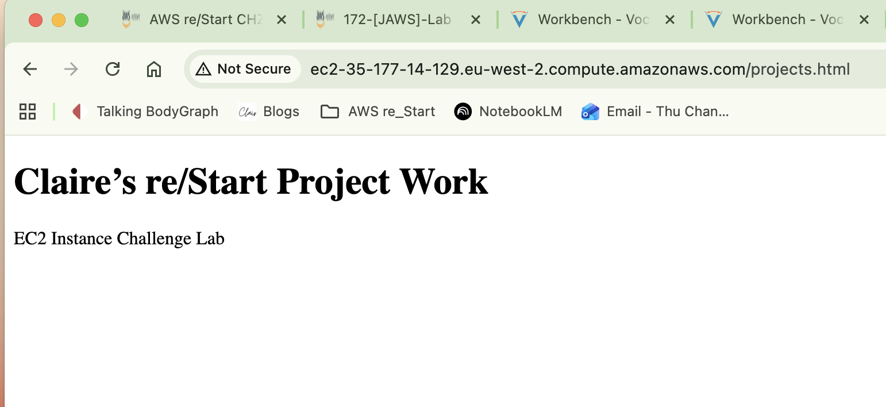

## Lab Descriptioin
### User Friendly ###
Instead of just turning on a computer, I built a private, secure digital office from scratch. I used an automated script to set up the website instantly so I didn't have to do it by hand. For better security, I logged in using my digital ID rather than a physical key file that could be lost. Finally, I checked the server's history logs to confirm everything was perfect and ready for real visitors.

### Tech ###
In this lab, I moved from simple resource management to full-stack Infrastructure Provisioning. I designed a custom VPC and Subnet to ensure network isolation and used User Data scripts to automate the installation of a web server. By choosing a Keyless configuration, I prioritized Identity-based access via EC2 Instance Connect. I validated the success of the automation by auditing the System Logs, ensuring the environment was 'Production Ready' immediately upon launch.

## 🔍 Troubleshooting: Missing Network Resources
**Issue:** The "VPC lab" was not visible in the EC2 Launch Instance dropdown.

### 💡 Root Cause Analysis:
1. **Regional Isolation:** Verified if the console was set to the correct AWS Region (e.g., us-west-2).
2. **Resource Persistence:** Noted that in new lab environments, previous VPCs are decommissioned to provide a "Clean Slate."
3. **Dependency Order:** Realized that a **new** VPC must be provisioned in the VPC Console before it can be selected in the EC2 Launch Wizard.

> **Transformation Insight:** Cloud architecture is hierarchical. You cannot "provision" a server into a network that doesn't exist yet. This reinforces the importance of the **Infrastructure Build Order**.
## ❌ Troubleshooting: IAM Authorization Failure (iam:PassRole)
**Issue:** Instance launch failed with an "Unauthorized" error message.

### 🔍 Root Cause Analysis:
- **Error:** `iam:PassRole` violation for `role/EMR_EC2_DefaultRole`.
- **Reason:** In AWS, attaching a role to a service requires the `PassRole` permission. This error occurred because I attempted to associate a non-lab role that my current identity was not authorized to "pass" to the EC2 service.

### 🔧 Remediation:
1. Modified the **Instance Configuration**.
2. Reset the **IAM Instance Profile** to "None" within the Advanced Details section.
3. Successfully re-initiated the launch process.

* 
  
# 🌐 Infrastructure Layer: Provisioning the Lab VPC
**Task:** Create a custom, isolated network environment for the Web Application.

### 🏗️ Configuration Details:
| Component | Selection | Purpose |
| :--- | :--- | :--- |
| **Name Tag** | `Lab-VPC` | Identification and resource organization. |
| **CIDR Block** | `10.0.0.0/16` | Defines the private IP address space for the network. |
| **Subnet Type** | `Public` | Allows the EC2 instance to be reachable via the Internet Gateway. |
| **Gateway** | `Internet Gateway (IGW)` | Provides the "Default Route" for internet-bound traffic. |

> **Transformation Insight:** Using the "VPC and more" wizard demonstrates **Operational Excellence**. It ensures that the **Route Tables** are correctly associated with the **Subnets** automatically, reducing the risk of a "Silent Failure" where a server has a public IP but no path to the internet.

## 🔍 Task: Programmatic Metadata Retrieval
**Action:** Used the AWS CLI to retrieve the Public IPv4 DNS of the Web Server.

### ⚙️ Technical Execution:
- **Command:** `aws ec2 describe-instances`
- **Logic:** Applied a **Filter** for the instance Name and a **Query** to isolate the DNS string.
- **Result:** Successfully identified the public endpoint for browser-based verification.

> **Transformation Insight:** Relying on the CLI for information retrieval is a key step toward **Infrastructure Automation**. It allows scripts to find and use resources dynamically without human intervention.

* 
