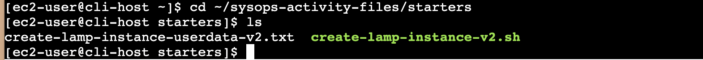
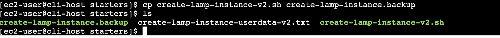
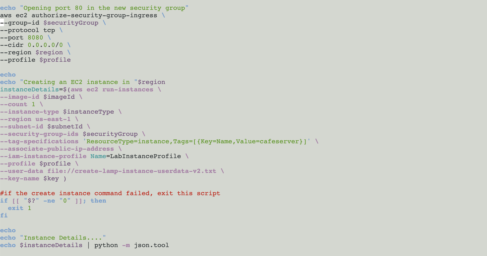
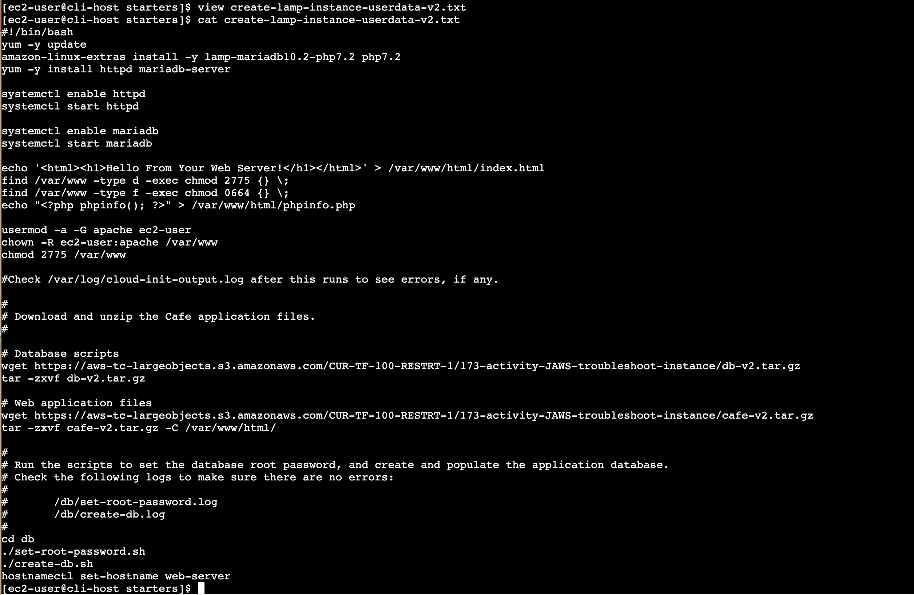
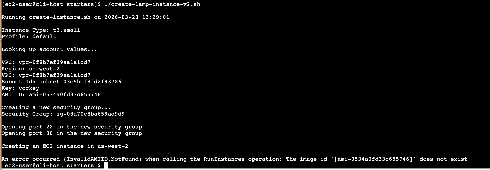
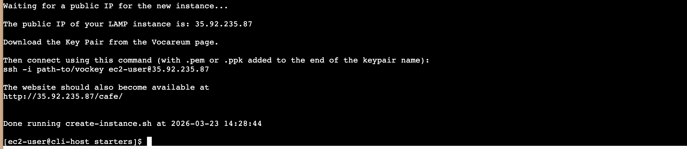
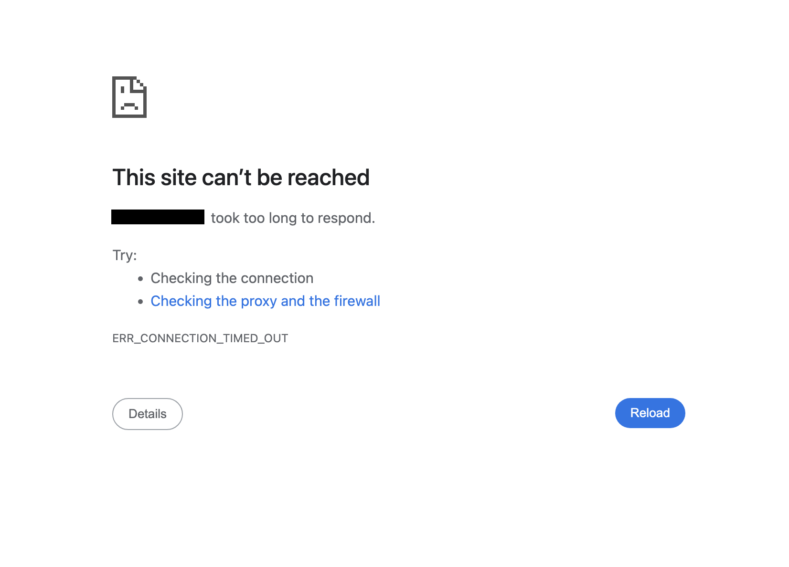
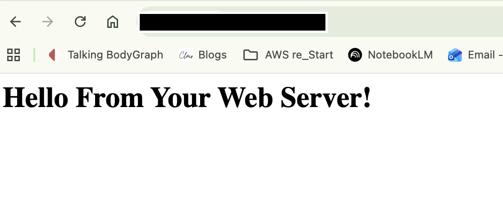

# AWS re/Start Lab: Automating & Troubleshooting EC2 Deployments

**Date:** 23 March 2026  
**Project:** Café Web Application Infrastructure  
**Lab Objectives:** This lab focuses on moving beyond the AWS Management Console to utilize the AWS Command Line Interface (CLI) for infrastructure deployment. The primary goal is to provision a high-performance web server hosting a LAMP Stack using automated scripts, followed by rigorous network troubleshooting to ensure service availability.

---

## Step 1. Open AWS EC2 Management Console
**Action** Navigated to the EC2 Dashboard to identify the administrative resources provisioned for the lab environment.

## Step 2. Connected to the CLI Host
**Action** Utilized EC2 Instance Connect to launch a secure, browser-based SSH terminal.

## Step 3. Establishing CLI Identity & Environment
**Action:** Configured the AWS Command Line Interface (CLI) to authenticate with the lab environment.

### Technical Execution:
To authorize the terminal to manage AWS resources, I executed the `aws configure` command and provided the following four parameters:

1. **AWS Access Key ID:** The unique "Username" for the CLI session.
2. **AWS Secret Access Key:** The "Password" used to sign programmatic requests securely.
3. **Default Region:** Specified the **LabRegion** to ensure all resources (EC2, VPC) are created in the correct geographic data center.
4. **Default Output Format:** Set to `json` for structured, machine-readable responses—standard practice for automation scripts.

## Step 4. Creating an EC2 instance by using the AWS CLI
**Action:** First, created a backup of the script that was modified in a later step.

### Technical Execution:
1. **Changed to the directory where the script file exists** `cd ~/sysops-activity-files/starters`
2. **Used command to check the script file exists** `ls`

3. **Created a backup** `cp create-lamp-instance-v2.sh create-lamp-instance-v2.backup`

4. **Opened the create-lamp-instance-v2.sh script file in a command line text editor** `view create-lamp-instance-v2.sh`
5. **Analyzed the contents of the script** 

6. **Displayed the contents of userdata script** `cat create-lamp-instance-userdata-v2.txt`

**Note Taken** the difference between `cat [Filename]` and `view [Filename]`

7. **Run the script** `./create-lamp-instance-v2.sh`

## Issue 1
An error occurred (InvalidAMIID.NotFound) when calling the RunInstances operation: The image id '[ami-xxxxxxxxxx]' does not exist

### Troubleshooting & Remediation: The "Hot-Fix"
* **Root Cause:** Wrong Region Name `--region us-east-1`
* **Fix:** Change that line to: `--region $region`

## Issue 2
Test Web Page cannot be loaded. 

### Troubleshooting & Remediation: The "Hot-Fix"
1. **Run the command to install nmap which is a port scanning tool:** `sudo yum install -y nmap`
2. **Run the command to Replace <public-ip>:** `nmap -Pn <public-ip>`
3. **Added inbound rules to open port 80**

* **Root Cause:** The web server was unreachable due to a missing Port 80 (HTTP) inbound rule and an outdated IP reference.
* **Fix:** Added the Port 80 rule to the Security Group and updated the target IPv4 address, resulting in a successful page load.

## Step 5. Verifying Cafe Web Page is running successfully
1. **Run command to see the log file entries** `sudo cat -f /var/log/cloud-init-output.log`
2. 

---
