# AWS re/Start Lab: Automating & Troubleshooting EC2 Deployments

**Date:** 23 March 2026  
**Project:** Automated Reporting   
**Lab Objectives:** The goal of this activity is to deploy a fully automated, serverless reporting solution. Using AWS Lambda, the system will extract sales data from a MariaDB database (running on a LAMP stack) and distribute a daily analysis report via Amazon SNS to administrative stakeholders.   
By the end of this lab, I will have demonstrated the ability to:

* **Deploy Serverless Logic:** Configure and deploy AWS Lambda functions to handle data extraction and report generation.
* **Implement Event-Driven Triggers:** Schedule automated report generation using Amazon CloudWatch Events (EventBridge) for a daily 8 PM execution.
* **Secure Credential Management:** Utilize AWS Systems Manager Parameter Store to securely store and retrieve database connection strings, avoiding hardcoded secrets.
* **Integrate Multi-Tier Services:** Bridge the gap between serverless functions and VPC-based resources (MariaDB on EC2).
* **Automate Notifications:** Configure Amazon SNS (Simple Notification Service) to push automated email reports to end-users.

**Workflow**   
1. **Trigger:** CloudWatch Events fires at 8 PM daily.
2. **Process:** The "Report" Lambda triggers the "Extractor" Lambda.
3. **Data:** The Extractor pulls sales records from the MariaDB database.
4. **Delivery:** The results are formatted and sent to an SNS Topic.
5. **Output:** The Admin receives the report via email.

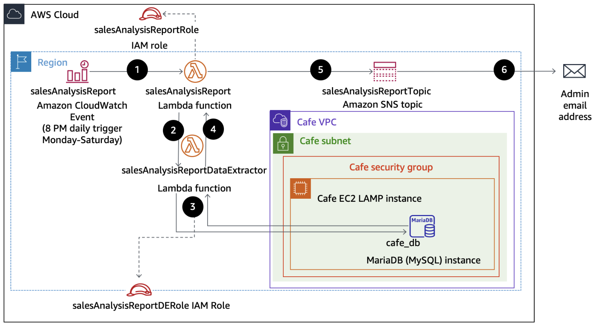

## Part 1 : Opened the AWS Management Console
## Part 2 : Identity & Access Management (IAM) Observation

**Action** I began with a security audit of the two **pre-provisioned** IAM `roles—salesAnalysisReportRole` and `salesAnalysisReportDERole` to verify the permissions required for our serverless architecture.

Figure: Pre-provisioned IAM roles identified within the AWS Console.
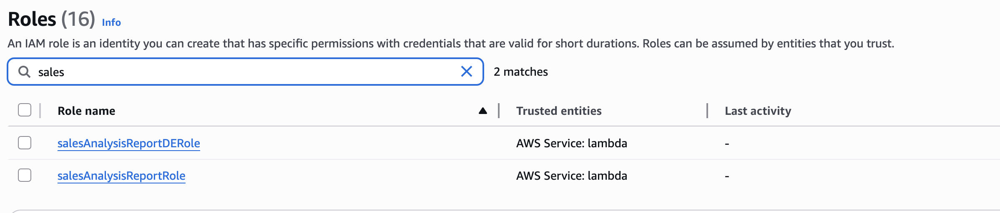

**[!NOTE]**
Why Pre-provisioned? Using pre-created roles allowed me to focus the lab on the functional logic of the Lambda functions while ensuring that the "Least Privilege" security model was already correctly established.  

1. **Observed the salesAnalysisReport IAM role settings**
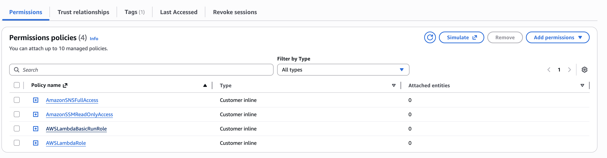

2. **Observed the salesAnalysisReportDERole IAM role settings**
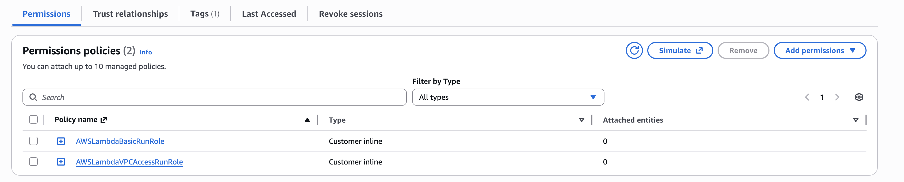

3. **Artifact Retrieval & Dependency Preparation**
**Action** To streamline the deployment, I utilized two pre-developed ZIP archives:
- `pymysql-v3.zip` **(The Lambda Layer):** Contains the PyMySQL open-source client library. This provides the "driver" necessary for a Python-based Lambda function to communicate with a MariaDB/MySQL database.
-  `salesAnalysisReportDataExtractor-v3.zip` **(The Lambda Function):** The core application logic. This script is designed to retrieve sales records from the Café database and format them for the final report.

**[!NOTE]**
Modular Development: These artifacts were pre-developed for the lab to simulate a real-world workflow where a Developer provides a code package, and a Cloud Engineer (me) is responsible for the deployment and infrastructure integration.

## Part 3 : Created a Lambda layer and a Lambda function to extract data

### Step 1: Created a Lambda layer to provide database connectivity

**Layer Name:** `pymysqlLibrary`   
**Artifact:** `pymysql-v3.zip` (PyMySQL client library)
**Runtime:** `Python 3.14` (Modernized from 3.9 for current environment compatibility)
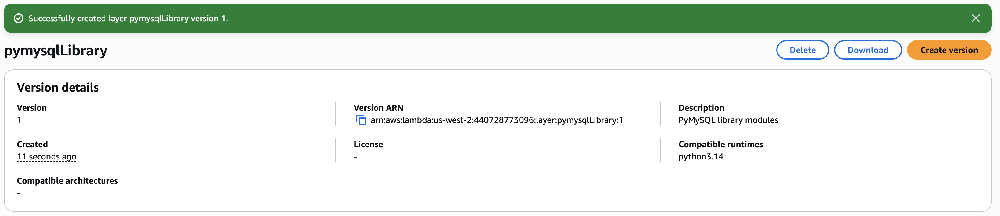

**[!NOTE]**
The `pymysqlLibary.zip` file used in this lab was packaged using the following folder structure:

### Step 2: Created a Lambda funtion to extract data from database

**Function Name:** `salesAnalysisReportDataExtractor`   
**Runtime:** `Python 3.14` (Modernized from 3.9 for current environment compatibility)   
**Permissions:** Assigned the pre-provisioned `salesAnalysisReportDERole` to grant the function.  

Successfully created the function salesAnalysisReportDataExtractor.
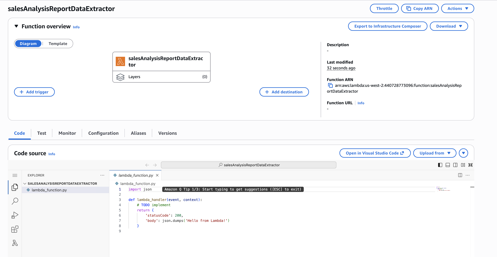

### Step 3: Integrated the database driver into the function to enable communication with MariaDB.
**Purpose:** To inject the PyMySQL library into the function environment, allowing the Python code to query the external database without bundling the library in the main code package.

**Layer Source:** Custom layers   
**Layer Name:** `pymysqlLibrary`   
**Version:** 1
Successfully created the layer to function.
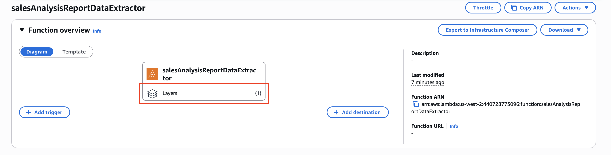

### Step 4: Imported Python Code to extract data
**Action:** Uploaded the core application code and configured the execution entry point.

**Handler:** `salesAnalysisReportDataExtractor.lambda_handler`   
**Artifact:** `salesAnalysisReportDataExtractor-v3.zip`   
**Purpose:** To enable dynamic, secure data extraction. By receiving database credentials (dbURL, dbName, dbUser, and dbPassword) via the event parameter, the function avoids the security risk of hardcoding secrets. This "Event-Driven" design ensures the function is reusable across different database environments (e.g., Test vs. Production).   
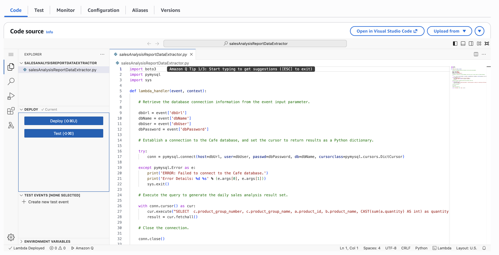

### Step 5: Configured Network Connectivity
**Action:** Provisioned a virtual network bridge to allow the serverless function to access the private database environment.   
**VPC:** `Cafe VPC`   
**Subnet:** `Cafe Public Subnet 1`   
**Security Group:** `CafeSecurityGroup`   

**Purpose:** To establish a secure connection between the Lambda function and the MariaDB instance. By "plugging" the function into the VPC, AWS creates an Elastic Network Interface (ENI) that allows the code to bypass the public internet and query the database directly over the internal network

> **[!Note]** The networking components (VPC, Subnets, and Security Groups) utilized in this task were **pre-provisioned** by the lab environment. This simulates a real-world enterprise scenario where the "Cloud Operations" team manages the core network security, allowing the "Serverless Developer" to focus strictly on application logic and code deployment.

## Part 4  : `salesAnalysisReportDataExtractor` function is now ready to be Tested

### Step 1: Accessed AWS Systems Manager (SSM) Parameter Store to securely retrieve connection strings for the MariaDB instance.   
**Action:** Accessed AWS Systems Manager (SSM) Parameter Store to securely retrieve connection strings for the MariaDB instance.   

**Service Used:** `Systems Manager > Parameter Store`   
**Parameters Retrieved:**   
- `/cafe/dbUrl`
- `/cafe/dbName`
- `/cafe/dbUser`
- `/cafe/dbPassword`
**Purpose:** To implement **Centralized Configuration Management.** By storing sensitive database credentials in Parameter Store rather than hardcoding them, the architecture remains secure and follows the **Separation of Concerns** principle. This allows the operations team to update passwords or database URLs without needing to modify the Lambda function's source code.

### Step 2: Configured a manual test event to validate the database connection logic.

**Event Name:** SARDETestEvent   
**Input Parameters:** JSON object containing MariaDB credentials (dbUrl, dbName, etc.) mapped from Systems Manager Parameter Store.  
**Test Event:** Successfully created Test Event
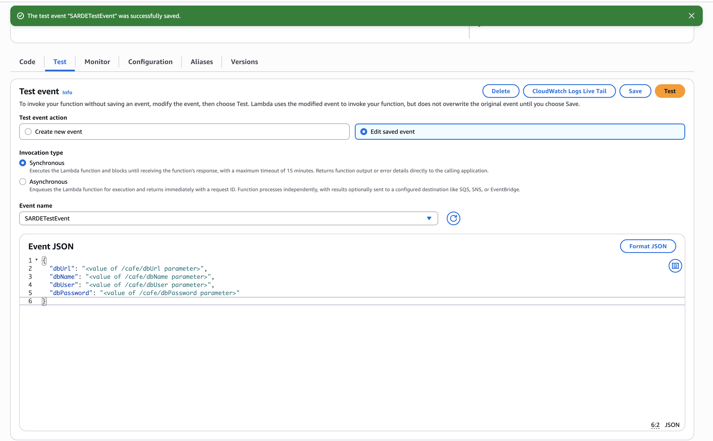)   

### Step 3: Triggered Event Test from Step 2
**Action:** Executed a manual Test Event (SARDETestEvent) to verify the Lambda's ability to ingest credentials and reach the MariaDB instance.   
**Initial Result:** [ERROR] Runtime.ImportModuleError: No module named 'salesAnalysisReportDataExtractor'   
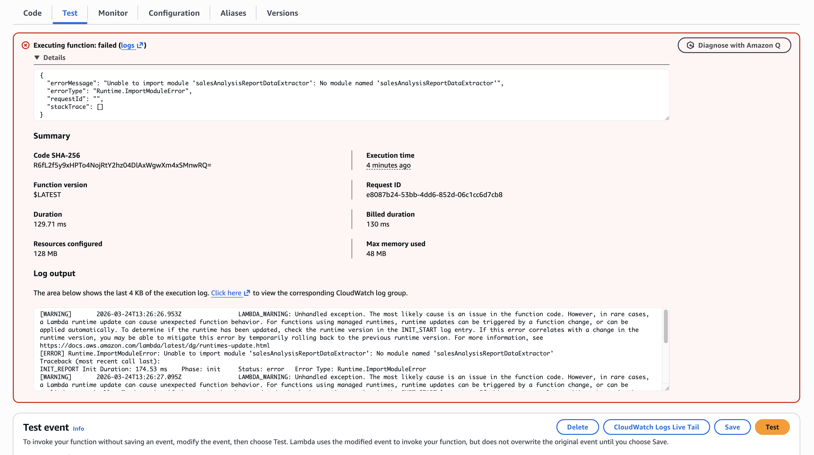

**Troubleshooting:** Identified a Deployment Gap. The runtime was initialized before the source code artifact (.zip) was successfully synchronized with the Lambda environment.   
**Resolution:** Re-uploaded the salesAnalysisReportDataExtractor-v3.zip file and verified the presence of the .py script in the Code Source panel.   

**Second Result:** [ERROR] Can't connect to MySQL server on '<value of /cafe/dbUrl parameter>'   

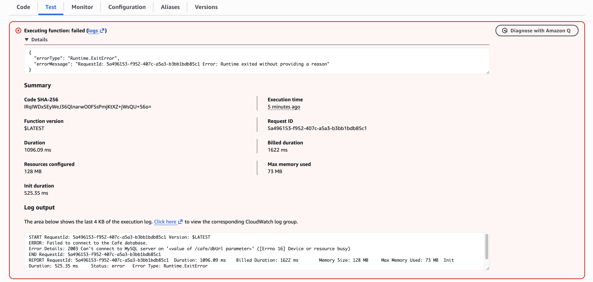

**Resolution:** Updated the `SARDETestEvent` JSON payload by replacing the `<placeholder>` tags with the live metadata retrieved from the SSM Parameter Store.

**Final Result:** [ERROR] `Status: timeout` . This error indicates that the function timed out after 3 seconds. "Successful Failure"   
**Purpose:** This result confirms that the Python 3.12 environment is properly initialized, the PyMySQL layer is active, and the code is successfully attempting to reach the MariaDB instance. The timeout is the expected behavior at this stage.

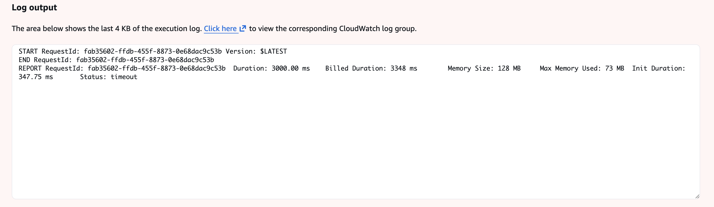

### Step 4: Analyzed and Resolved The Last Issue from Step 3
**Action:** Modified the VPC Security Group rules to permit inbound traffic from the serverless compute layer to the database engine.

**Rule Added:** `Type: MySQL/Aurora | Protocol: TCP | Port: 3306`   
**Source:** `salesAnalysisReportDERole / Lambda Security Group`   
**Purpose:** To complete the network "handshake." By explicitly allowing Port 3306, the database firewall now recognizes the Lambda function as a trusted caller, resolving the previous 3.0s connection timeout and allowing the PyMySQL driver to retrieve sales records.   
**Result:** Status: Success   
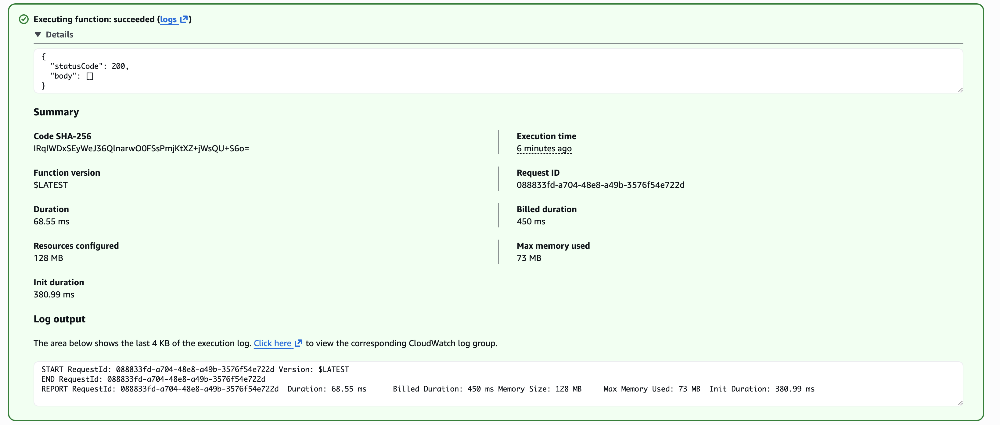   

### Step 5: End-to-End Data Validation
**Action:** Populated the MariaDB instance with live order data via the Café web interface and verified the extraction logic.   
**Interface:** `http://[CafePublicIP]/cafe`   
**Test Result:** `"statusCode": 200`
**Output:** Validated JSON payload containing real-time sales data   
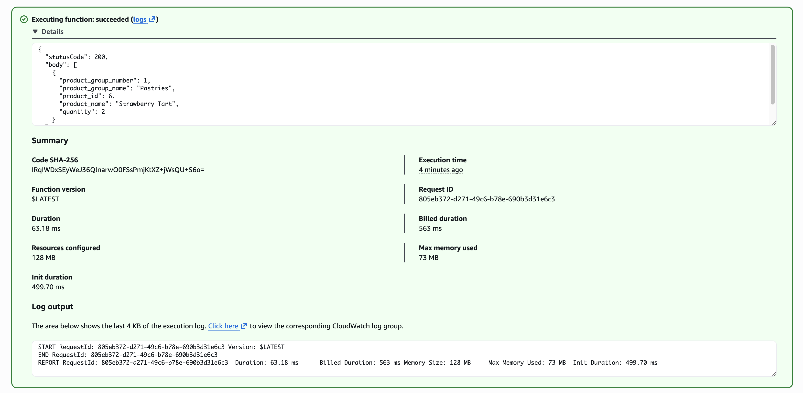  

**Purpose:** To verify "Full-Stack" connectivity. This test confirms that data flows correctly from the **Web UI → EC2/MariaDB → Lambda Extractor.**

## Part 4 : Configured Notifications
### Step 1: Provisioning the SNS Messaging Hub   
**Action:** Created an Amazon SNS (Simple Notification Service) topic   
**Topic Name:** `salesAnalysisReportTopic`  
**Display Name:** `SARTopic` (This appears as the "Sender" name in email inboxes).   
**Topic Type:** `Standard`   
**Topic ARN:** `[ARN Value]`
**Purpose:** To decouple the report generation from the delivery process. SNS acts as a central hub, automatically pushing that message to any number of subscribers (Email, SMS, or Slack) without requiring any changes to the code.    
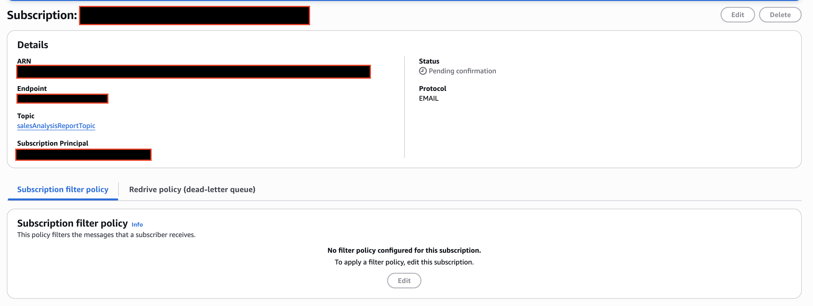  

### Step 2: Authorizing Email Notifications**
**Action:** Registered a personal email endpoint as a subscriber to the `salesAnalysisReportTopic`.

* **Protocol:** `Email`
* **Endpoint:** `[Personal Email Address]`
* **Status:** `Confirmation Email`
* 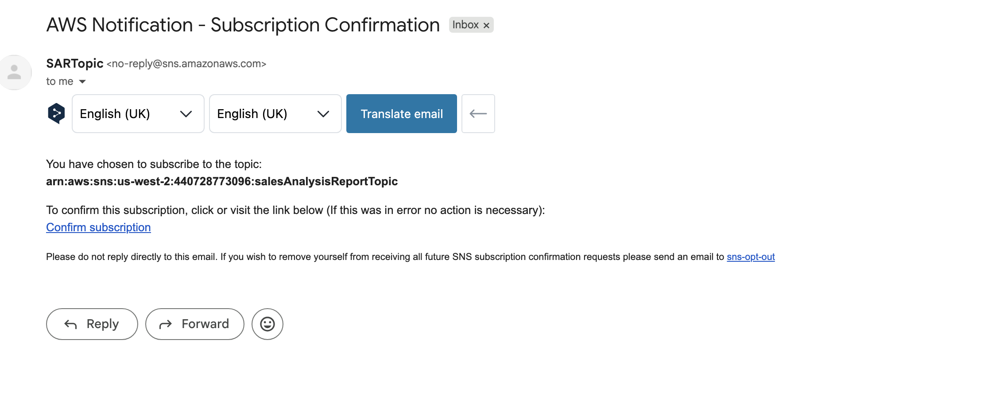
* **Purpose:** To establish a secure communication bridge. This "Opt-In" process ensures that only authorized recipients receive the automated sales reports, maintaining a secure and spam-free notification pipeline.
* **Status:** Confirmed (Verified via automated AWS confirmation link).
* 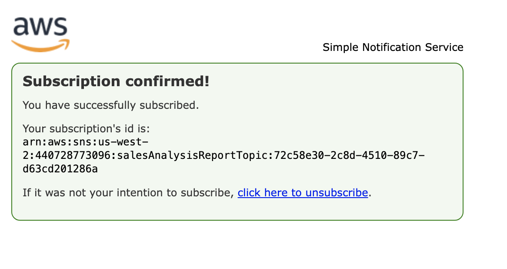

## Part 5 : Provisioning the Central Report Orchestrator
### **Step 1. Initializing the Development Environment**
**Action:** Established a secure remote session to the `CLI Host` instance using **EC2 Instance Connect**.

* **Environment:** Linux instance pre-loaded with AWS CLI and Python deployment scripts.
* **Purpose:** To transition from manual console configuration to **Command Line Orchestration**. This environment provides the necessary tools and scripts to programmatically deploy the core report orchestrator.

### **Step 2. Authenticating the Command Line Environment**
**Action:** Executed the `aws configure` command to link the CLI Host with the active AWS account.

* **Configuration:** Provided the **Access Key**, **Secret Key**, and set the default region to `[Region]`.
* **Output Format:** Set to `json` for standard programmatic parsing.
* **Purpose:** To "log in" and give the computer permission to talk to AWS. This turns the server into a remote control for your account, allowing you to build and manage services by typing commands instead of clicking buttons.

### **Step 3. Programmatic Lambda Deployment**
**Action:** Used the `aws lambda create-function` command to deploy the `salesAnalysisReport` function from the CLI Host.

* **Command Parameters:**
    * `--zip-file`: The file containing the Python code.
    * `--role`: The ARN (ID) of the IAM role that gives the function its permissions.
    * `--handler`: Tells AWS which file and function to run first.
* **Purpose:** To build the function using a "remote control" command. This is faster and more professional than clicking through the console because it ensures the function is set up exactly the same way every time.

### **Observation: The Role of Dual ARNs in Orchestration**
**Action:** Identified and mapped two separate Amazon Resource Names (ARNs) to the `salesAnalysisReport` function.

* **IAM Role ARN (The "Permission"):** Assigned during the `create-function` command. This acts as the function's security credential, allowing it to interact with other AWS services.
* **SNS Topic ARN (The "Destination"):** Stored as an environment variable. This provides the function with the exact address of the communication hub.

**Technical Takeaway:** This dual-ARN setup demonstrates the **Principle of Least Privilege**. One ARN defines what the function is *allowed* to do (IAM), while the other defines *where* the function should deliver its results (SNS). Keeping these separate allows for more modular and secure cloud design.

### **Step 4. Configured Function Environment Variables**
**Action:** Injected the `topicARN` into the `salesAnalysisReport` Lambda function via the Environment Variables configuration.

* **Key:** `topicARN`
* **Value:** `[SNS Topic ARN]`
* **Purpose:** To implement **Configuration Externalization**. Line 26 of the Python script is hardcoded to look for a variable named `topicARN`. By providing this value in the Lambda settings rather than the code itself, we ensure the function remains modular and easy to update without redeploying the source code.

### **Step 5. Final Orchestration & Email Validation**
**Action:** Executed a manual unit test using a `SARTestEvent` to trigger the complete reporting pipeline.

* **Test Result:** `Execution result: succeeded`
* **Response:** `{"statusCode": 200, "body": "Sale Analysis Report sent."}`
* **Final Outcome:** Successfully received the "Daily Sales Analysis Report" email containing real-time data from the MariaDB instance.
* **Purpose:** To verify the **End-to-End (E2E) Workflow**. This confirms that the Orchestrator successfully invokes the Data Extractor, processes the relational data, and delivers the final report via the SNS messaging hub.
* * 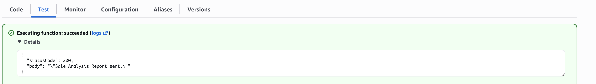
 
### **Task 6. Automating the Reporting Pipeline**
**Action:** Configured an **Amazon EventBridge (CloudWatch Events)** trigger to automate the execution of the `salesAnalysisReport` function.

* **Trigger Type:** Schedule Expression (Cron)
* **Rule Name:** `salesAnalysisReportDailyTrigger`
* **Schedule:** `cron(0 20 ? * MON-SAT *)` (Configured for 8 PM UTC, Monday through Saturday).
* **Purpose:** To transition from manual invocation to **Scheduled Automation**. This ensures that stakeholders receive the Sales Analysis Report consistently without human intervention, transforming the project into a true "hands-off" production pipeline.
---

### **Documentation Standard & ID Schema**
All entries in this log follow a standardized naming convention: **[Type][Lab ID]-[Sequence]**.

* **Prefix (Type):**
    * **O (Reservation):** Strategic notes or observations regarding the architecture and environment behavior.
    * **I (Issue):** Active blockers, bugs, or configuration errors encountered during deployment.
* **Lab ID (178):** The project identifier.
* **Sequence (01-08):** The chronological order of events.

## Lab Observations & Issue List

The following table documents deviations from the lab manual, technical hurdles, and key architectural notes identified during the deployment.

| ID | Category | Observation / Issue | Resolution / Note |
| :--- | :--- | :--- | :--- |
| **O178-01** | **Runtime** | Specified Python 3.9 is deprecated in the 2026 console. | **Migrated to Python 3.14** to ensure modern support and security. |
| **O178-02** | **Database** | EC2 instance runs **MariaDB**, not standard MySQL. | Confirmed MariaDB as a "drop-in replacement" using **Port 3306**. |
| **I178-03** | **Deployment** | Received `Runtime.ImportModuleError`. | **Artifact Sync.** Re-uploaded the .zip file and verified the Handler path. |
| **I178-04** | **Validation** | `Error 2003` due to unreplaced placeholder text. | **Data Correction.** Swapped manual strings for actual SSM Parameter values. |
| **O178-05** | **Timeout** | Function timed out at exactly 3.0s (AWS Default). | **Performance Tuning.** Increased timeout to 15s to account for Cold Starts. |
| **O178-06** | **Architecture** | Requirement for two distinct ARN types. | **Dual ARN Mapping.** Used IAM Role ARN for Identity and SNS ARN for Destination. |
| **I178-07** | **Security** | Connection blocked by VPC firewall (Port 3306). | **Firewall Update.** Authorized the Lambda Security Group in the Inbound Rules. |
| **O178-08** | **Automation** | Implemented a Cron-based schedule (EventBridge). | **Serverless Scheduling.** Configured the report for 8 PM UTC (Mon-Sat). |
