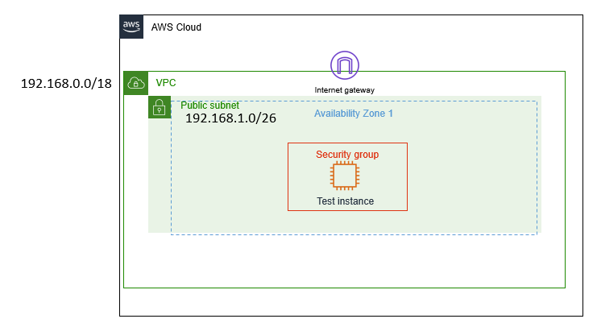
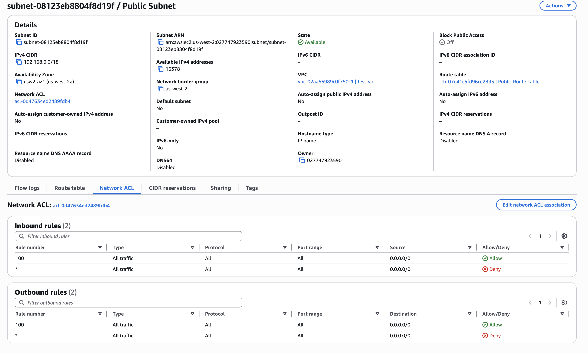
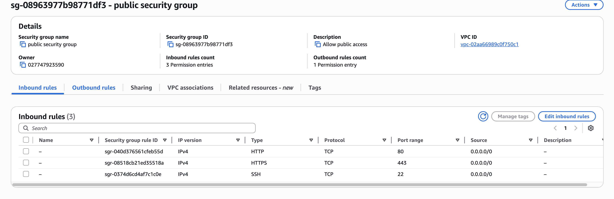
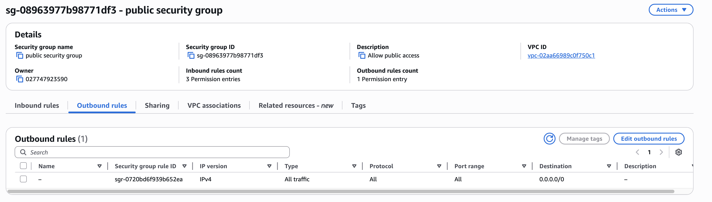
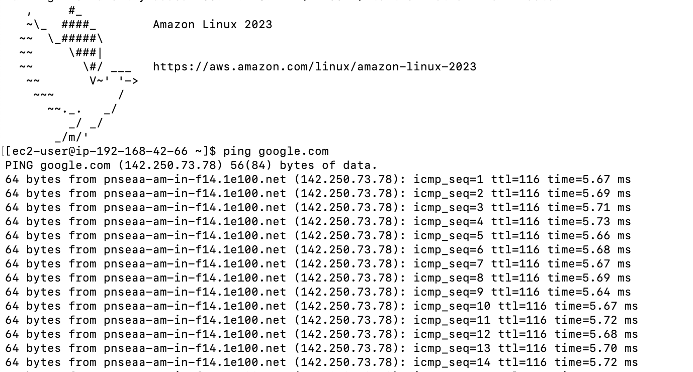

# Lab: Architecting Connectivity in Amazon VPC

**Date:** 2026-04-13  

---

### Lab Description
This lab focuses on the end-to-end creation of a routable network within AWS. The goal is to move beyond basic VPC creation and implement the routing, security, and gateway components required for an EC2 instance to communicate with the public internet. 

### Lab Objectives
* **VPC Infrastructure:** Provision a custom VPC and associated subnets.
* **Internet Connectivity:** Deploy and attach an **Internet Gateway (IGW)**.
* **Routing Logic:** Configure **Route Tables** to direct traffic toward the IGW.
* **Multi-Layer Security:**
  * Implement **Security Groups (SG)** for instance-level stateful filtering.
  * Implement **Network Access Control Lists (NACL)** for subnet-level stateless filtering.
* **Validation:** Launch an EC2 instance and successfully `ping` an external address to verify outbound connectivity.

---

### Client Requirement: Ticket #1288
**Customer:** Brock, Startup Owner  
**Issue:** Connectivity Failure.  
The client has a VPC but cannot reach the internet. Specifically, they are unable to perform a basic `ping` test to external resources. 

**Requirement Summary:**
1. Establish a fully functional, routable network.
2. Ensure the instance can communicate outside the VPC boundaries.
3. Verification is complete only when an external ICMP (ping) request is successful.

**Client's Architecture**    

### VPC Created

| Component | Identifier / Name | Configuration Details |
| :--- | :--- | :--- |
| **VPC** | `Test VPC` | CIDR: `192.168.0.0/18`  |
| **Public Subnet** | `Public subnet` | CIDR: `192.168.1.0/26` |
| **Internet Gateway** | `IGW test VPC` | Attached to Test VPC  |
| **Route Table** | `Public route table` | Route: `0.0.0.0/0` -> `IGW`  |

---

### Security Configuration

#### 1. Network ACL (Subnet Level - Stateless)
* **Name:** `Public Subnet NACL`
* **Inbound Rule 100:** Allowed **All Traffic** from `0.0.0.0/0`.
* **Outbound Rule 100:** Allowed **All Traffic** to `0.0.0.0/0`.

#### 2. Security Group (Instance Level - Stateful)
* **Name:** `public security group`.
* **Inbound Rules:** Allowed SSH (22), HTTP (80), and HTTPS (443) from anywhere.
* **Outbound Rules:** Allowed **All Traffic** to `0.0.0.0/0`.
**Inbound Rules**

**Outbound Rules**

---

**Key Resolution Steps:**
1. **IGW Attachment:** Created the Internet Gateway and explicitly attached it to the VPC to enable internet potential.
2. **Default Route:** Added the `0.0.0.0/0` destination to the Public Route Table, targeting the IGW as the "next hop" for internet traffic.
3. **Subnet Association:** Explicitly associated the Public Subnet with the Public Route Table to apply the new routing logic.

---

### Final Verification
**Test:** `ping google.com`.
**Result:** **0% packet loss** with successful ICMP replies.

---End of Log---
