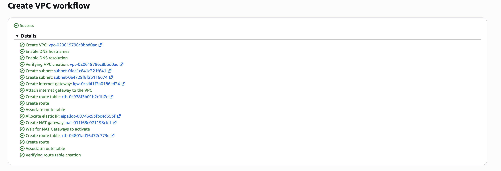
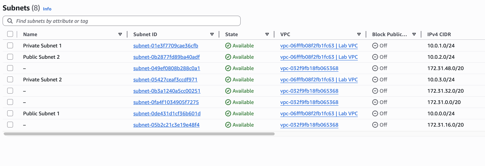
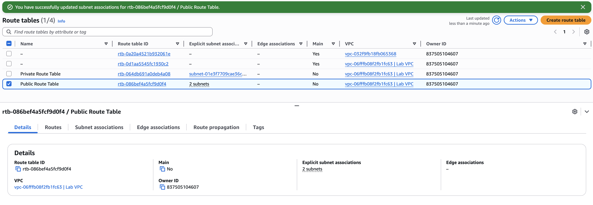
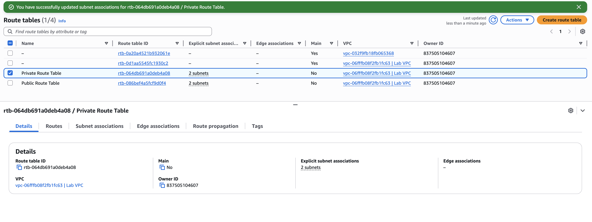
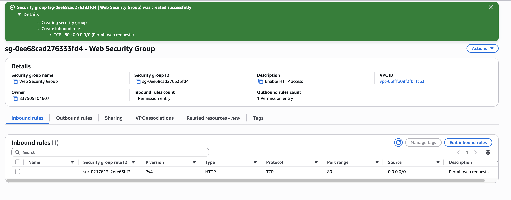
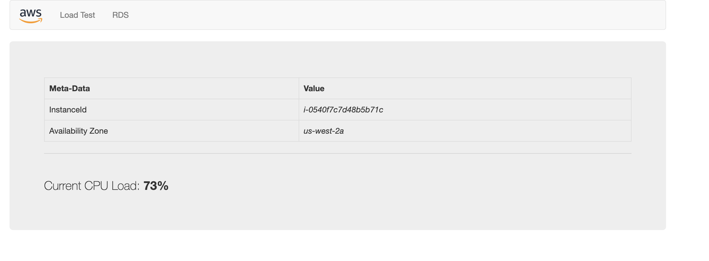
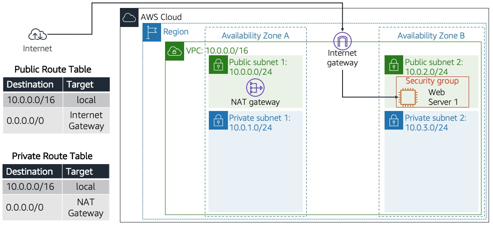

# Project: Multi-AZ Custom VPC Deployment

## Overview
This project demonstrates how to build a secure and reliable network using **Amazon Virtual Private Cloud (VPC)**. The architecture is designed to host a web server across two **Availability Zones (AZs)** to ensure the system stays online even if one data center has an issue. It uses a layered design with public and private sections to keep data safe while allowing web traffic to flow correctly.

## Client Architecture

---

## AWS Services In this project

* **Amazon VPC:** The private network used to host all resources in a secure, isolated environment.
* **Amazon EC2:** A virtual server used to host and run the Apache web server.
* **Internet Gateway (IGW):** The connection point that links the VPC to the internet.
* **NAT Gateway:** Allows servers in private subnets to download updates without being exposed to outside attacks.
* **Public & Private Subnets:** Network layers used to separate web-facing tools from sensitive data.
* **Route Tables:** The "navigation system" that tells network traffic where to go.
* **Security Groups:** Virtual firewalls that protect the EC2 instance by only allowing specific traffic.

---

## Project Phases

* **Phase 1: VPC Foundation** – Establishing the core **Amazon VPC** infrastructure, including the **Internet Gateway (IGW)** and initial subnet architecture.
* **Phase 2: High Availability Expansion** – Deploying additional subnets across a second **Availability Zone (AZ)** to ensure network redundancy and fault tolerance.
* **Phase 3: Network Routing & Connectivity** – Linking subnets to **Route Tables** for internet access.
* **Phase 4: Security Configuration** – Creating **Security Groups** to act as virtual firewalls.
* **Phase 5: Compute & Web Deployment** – Launching and bootstrapping an **Amazon EC2** instance to host the web application.
  
---

### **Phase 1: VPC Foundation & Network Scaffolding**

In this phase, the primary network container was established using the **VPC Wizard**. This automated process ensured that the **Internet Gateway**, **Subnets**, and **Route Tables** were correctly interconnected from the start.

#### **Technical Configuration**
| Setting | Value | Rationale |
| :--- | :--- | :--- |
| **IPv4 CIDR** | `10.0.0.0/16` | Chosen to provide a large address space (~65,536 IPs), allowing the Fortune 100 customer to scale their infrastructure in the future. |
| **Availability Zones** | 1 (Initial Setup) | Focusing on establishing a stable primary zone before expanding to a Multi-AZ architecture. |
| **Public Subnet** | `10.0.0.0/24` | Dedicated to web-facing resources that require direct access to the Internet Gateway. |
| **Private Subnet** | `10.0.1.0/24` | Created to isolate backend resources, ensuring they are not directly reachable from the public internet. |
| **NAT Gateway** | 1 AZ | Implemented to allow resources in the **Private Subnet** to securely download software updates without being exposed to inbound threats. |
| **VPC Endpoints** | None | Kept as 'None' for this phase to minimize complexity while focusing on core routing and connectivity. |

-

#### **Key Decisions & Logic**

* **Why "VPC and more"?** Using the "VPC and more" option ensures that the **Internet Gateway (IGW)** and **Route Tables** are automatically attached and configured. This reduces human error and ensures that the "Public" subnet is truly public and the "Private" subnet is properly isolated.
    
* **Why a /16 CIDR Block?** For a large enterprise (Fortune 100), using a smaller range (like /24) would be too restrictive. A **/16 block** provides the "Grounded" foundation needed to support thousands of future instances or microservices.

* **Why the NAT Gateway?** Security is a priority. By routing private subnet traffic through a **NAT Gateway**, the architecture provides a "one-way street" for internet access—instances can reach out for patches, but hackers cannot reach in.

### **Phase 1 Completed**
* Successfully created **Lab VPC**.

---

### **Phase 2: High Availability Subnet Expansion**

This phase focuses on expanding the network into a second **Availability Zone (AZ)**. Adding subnets across different physical locations ensures the infrastructure remains available even if one data center experiences an outage.

#### **Technical Configuration**

| Subnet Name | IPv4 CIDR Block | Availability Zone | Type |
| :--- | :--- | :--- | :--- |
| **Public Subnet 2** | `10.0.2.0/24` | us-west-2b | Public |
| **Private Subnet 2** | `10.0.3.0/24` | us-west-2b | Private |

#### **Design Logic**

* **Multi-AZ Redundancy:** By deploying subnets in both `us-west-2a` (Phase 1) and `us-west-2b` (Phase 2), the network achieves **High Availability**. If a failure occurs in one zone, resources in the second zone continue to function.
* **Sequential CIDR Addressing:** The IP ranges follow a logical order to simplify network management:
    * `10.0.0.x` & `10.0.1.x` → Availability Zone A
    * `10.0.2.x` & `10.0.3.x` → Availability Zone B
* **Capacity Planning:** Using `/24` masks for each subnet provides 251 usable IP addresses per tier, allowing for significant future growth of the server fleet.

#### **Phase 2 Completed**
* Created a multi-data center network footprint within the **Lab VPC**.

---

### **Phase 3: Network Routing & Subnet Association**

This phase focuses on connecting the newly created subnets to the existing routing infrastructure. By associating each subnet with a specific **Route Table**, the network defines how traffic flows to the internet and between Availability Zones.

#### **Technical Configuration**

| Subnet Name | Associated Route Table | Routing Target |
| :--- | :--- | :--- |
| **Public Subnet 2** | `Public Route Table` | **Internet Gateway (IGW)** |
| **Private Subnet 2** | `Private Route Table` | **NAT Gateway** |

#### **Design Logic**

* **Explicit Subnet Association:** By default, subnets use a main route table. Manually associating **Public Subnet 2** with the **Public Route Table** ensures it can send and receive traffic from the internet via the **Internet Gateway**.
* **Secure Private Routing:** Associating **Private Subnet 2** with the **Private Route Table** ensures that backend resources can access the internet for updates through the **NAT Gateway**, while remaining invisible to direct inbound traffic from the public internet.
* **Consistency Across Zones:** Linking subnets in the second Availability Zone to the same route tables created in Phase 1 ensures that the routing logic is identical across the entire VPC, simplifying network management.

#### **Phase 3 Completed**

* Activated internet connectivity for the second **Public Subnet**.

* Activated internet connectivity for the second **Private Subnet**.

---
### **Phase 4: Security Configuration (Security Groups)**

This phase involves establishing the security layer for the compute resources. By creating a **Security Group**, a virtual firewall is implemented to control exactly what traffic is permitted to reach the web server.

#### **Technical Configuration**

| Setting | Value | Purpose |
| :--- | :--- | :--- |
| **Security Group Name** | `Web Security Group` | Identifies the firewall rules for the web tier. |
| **Inbound Rule Type** | **HTTP (Port 80)** | Allows standard web traffic to reach the server. |
| **Source** | `0.0.0.0/0` (Anywhere) | Ensures the web server is accessible to users worldwide. |
| **VPC** | `Lab VPC` | Attaches the security rules to the specific project network. |

#### **Design Logic**

* **Stateful Firewalling:** Security Groups are stateful. This means if a web request is allowed to enter (Inbound), the response is automatically allowed to leave (Outbound) without needing a separate rule.
* **The Principle of Least Privilege:** Only **Port 80** is opened. By keeping other ports (like SSH or RDP) closed or restricted, the attack surface of the instance is minimized.
* **Instance-Level Protection:** Unlike a traditional network firewall, a Security Group sits directly at the **Network Interface** of the EC2 instance, providing a specific layer of defense tailored to that individual server.

#### **Phase 4 Completed**

* Defined a clear security boundary for the web server creating security group.

---

### **Phase 5: Compute Deployment & Web Hosting**

The final phase involves launching an **Amazon EC2** instance into the custom VPC and configuring it to serve as a functional web server. This step verifies that the networking, routing, and security configurations from the previous phases are working correctly.

#### **Technical Configuration**

| Setting | Value | Purpose |
| :--- | :--- | :--- |
| **Instance Name** | `Web Server 1` | Identifies the primary web resource. |
| **AMI** | Amazon Linux 2 | Provides a stable, high-performance Linux environment. |
| **Instance Type** | `t3.micro` | Cost-effective compute for testing and low-traffic loads. |
| **Subnet** | `Public Subnet 2` | Deploys the server into the second AZ to test cross-zone connectivity. |
| **Public IP** | Enabled | Assigns a reachable address for internet users. |
| **Security Group** | `Web Security Group` | Applies the firewall rules created in Phase 4. |

--

#### **User Data: Automated Bootstrapping**

To automate the setup, a **User Data** script was used during launch. This script performs the following tasks:
1.  **Software Installation:** Installs the Apache web server (`httpd`), MySQL, and PHP.
2.  **Deployment:** Downloads and unzips the web application files into the `/var/www/html/` directory.
3.  **Activation:** Configures the web server to start automatically on boot and starts the service immediately.

``bash
#!/bin/bash
# Install Apache Web Server and PHP
yum install -y httpd mysql php
# Download Lab files
wget [https://aws-tc-largeobjects.s3.us-west-2.amazonaws.com/CUR-TF-100-RESTRT-1/267-lab-NF-build-vpc-web-server/s3/lab-app.zip](https://aws-tc-largeobjects.s3.us-west-2.amazonaws.com/CUR-TF-100-RESTRT-1/267-lab-NF-build-vpc-web-server/s3/lab-app.zip)
unzip lab-app.zip -d /var/www/html/
# Turn on web server
chkconfig httpd on
service httpd start

## Troubleshooting: User Data Optimization

During the deployment phase, the standard lab-provided bootstrap script failed to initialize the web server correctly. Through analysis of the instance behavior, the script was optimized to ensure compatibility with **Amazon Linux 2** and **systemd**.

### **Comparison of Initialization Scripts**

| Feature | Original Lab Script | Optimized Script (Working) |
| :--- | :--- | :--- |
| **Service Management** | `service httpd start` | `systemctl start httpd` |
| **Persistence** | `chkconfig httpd on` | `systemctl enable httpd` |
| **Dependencies** | Assumed `unzip` was present | Explicitly installed `unzip` |
| **Reliability** | No OS updates | Included `yum update -y` |

### **The Working Script**

#!/bin/bash
yum update -y
yum install -y httpd php unzip
systemctl start httpd
systemctl enable httpd

cd /var/www/html
wget [https://aws-tc-largeobjects.s3.us-west-2.amazonaws.com/CUR-TF-100-RESTRT-1/267-lab-NF-build-vpc-web-server/s3/lab-app.zip](https://aws-tc-largeobjects.s3.us-west-2.amazonaws.com/CUR-TF-100-RESTRT-1/267-lab-NF-build-vpc-web-server/s3/lab-app.zip)
unzip lab-app.zip

# 3. Navigate to the web root and deploy application files
cd /var/www/html
wget [https://aws-tc-largeobjects.s3.us-west-2.amazonaws.com/CUR-TF-100-RESTRT-1/267-lab-NF-build-vpc-web-server/s3/lab-app.zip](https://aws-tc-largeobjects.s3.us-west-2.amazonaws.com/CUR-TF-100-RESTRT-1/267-lab-NF-build-vpc-web-server/s3/lab-app.zip)
unzip lab-app.zip´

#### **Phase 5 Completed**
Successfully launched the instance and loaded the page.

#### Completed architecture after deploying

---
**End of Log**
---

[← Back to Certifications & Badges](../../)
