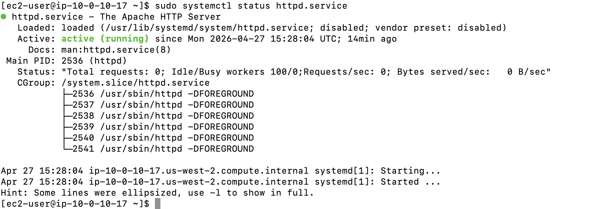
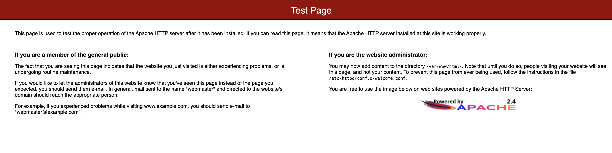
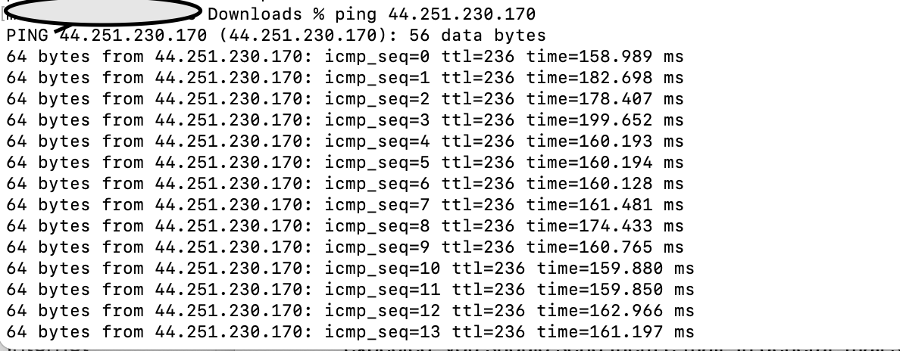

# Project: Troubleshooting a Network Connectivity Issue

## Overview
This project demonstrates the systematic process of identifying and resolving network "blockers" within an **Amazon Web Services (AWS)** environment. It focuses on diagnosing why a web server (Apache) is unreachable via the internet and `ping` (ICMP) requests, despite the instance being active.

---

## Scenario Analysis
A customer reported a failure to connect to an Apache web server. The server was created via the command line, but it does not respond to browser requests (HTTP) or `ping` commands.

### **Project Objectives**
* Analyze the customer scenario and architecture.
* Troubleshoot and resolve the connectivity issue.
* Restore full connectivity to the Apache web service.

---

## AWS Services In this project
* **Amazon VPC:** The private network hosting the architecture (10.0.0.0/16).
* **Amazon EC2:** The virtual server running the Apache web service.
* **Internet Gateway (IGW):** The entry point for public internet traffic.
* **Security Groups:** The stateful, instance-level firewall.
* **Network ACLs (NACLs):** The stateless, subnet-level firewall.
* [**Route Tables:** The routing rules for traffic flow within the VPC.

---

## **Phase 1: Initial Investigation & Service Status**

Before troubleshooting the network layers, the server software status is verified via **SSH**.

#### **Technical Configuration**
| Command | Result | Action |
| :--- | :--- | :--- |
| `sudo systemctl start httpd.service` | cite_start`active (running)`  | Service successfully activated. |

#### **Design Logic: Why start with the service?**
* **Elimination of Variables:** A common error is assuming the network is broken when the application itself isn't running. Verifying the software is "listening" on its ports is the first step in a professional investigation.

---

## **Phase 2: Network Infrastructure Auditing**

With the service running, the investigation shifts to the **VPC** layers to find why traffic is still being blocked from reaching the instance.

#### **Investigation Checklist**
| Component | Audit Task | Logic  |
| :--- | :--- | :--- |
| **Security Group** | Check Inbound Rules for Port 80 and ICMP. | If Port 80 (HTTP) is not open, the browser cannot reach the server. |
| **Network ACL** | Verify Inbound and Outbound rules. | NACLs are stateless; traffic must be explicitly allowed to enter and leave the subnet. |
| **Route Table** | Confirm route to Internet Gateway (IGW). | The instance requires a route to `0.0.0.0/0` via the IGW to communicate with the internet. |

#### **Design Logic: The "Outside-In" Approach**
* **Path Analysis:** Traffic flows through the IGW, then the Route Table, then the NACL, and finally the Security Group. By checking these in order, the project identifies exactly which "gate" is dropping the packets.

---

## **Phase 3: Resolution & Verification**

After modifying the necessary security and routing rules, the connection is verified by accessing the public IP address via a web browser.

**Expected Outcome:**
* **HTTP Connectivity:** Navigating to `http://<PUBLIC-IP>` loads the Apache Test Page.

* **Ping Connectivity:** The instance responds to ICMP requests, indicating the network path is fully open.

---
**End of Log**
---

[← Back to Certifications & Badges](../../)

