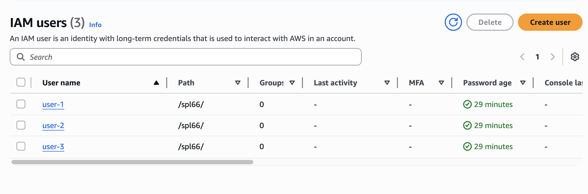
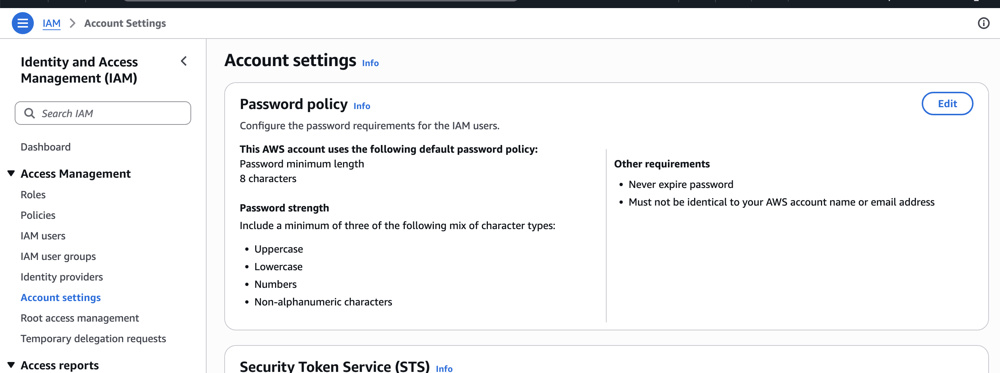
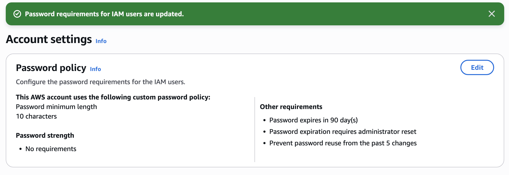
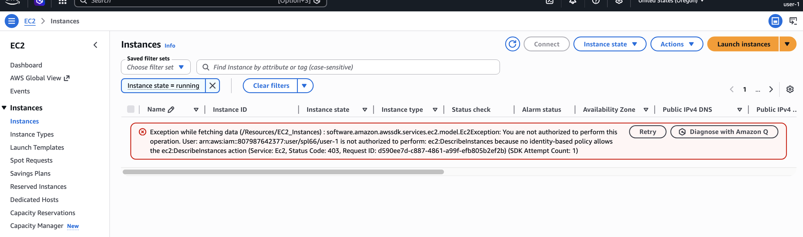
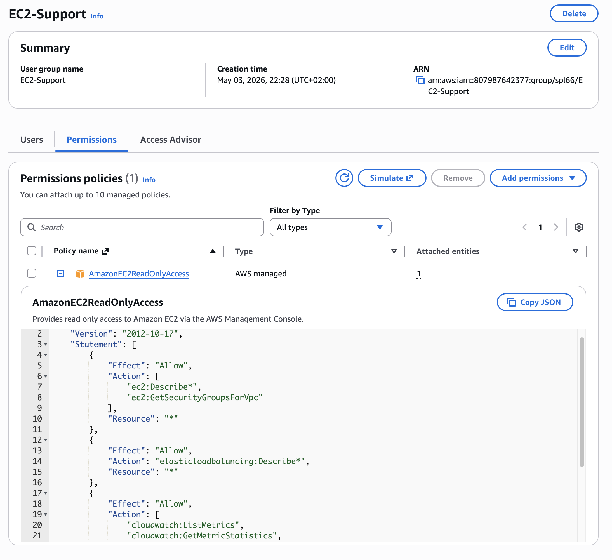
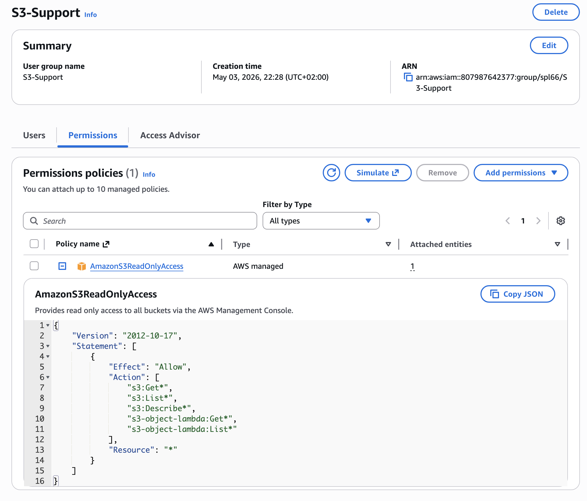
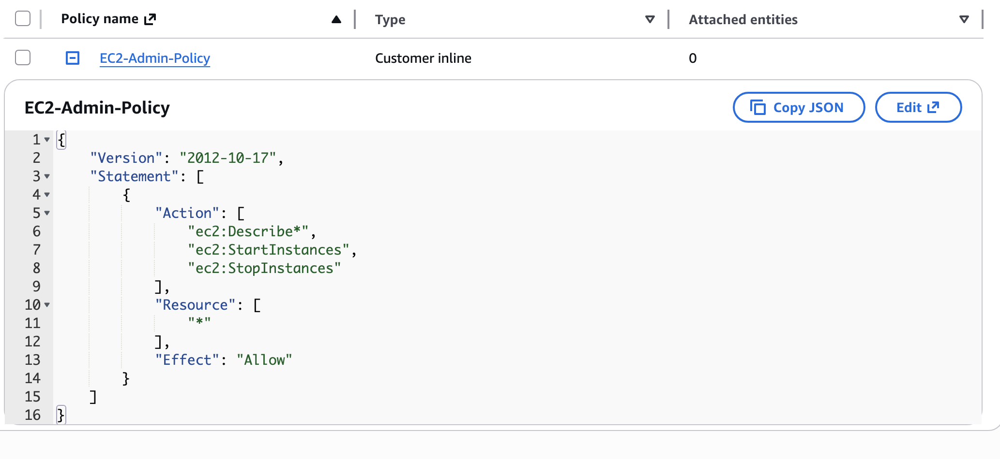
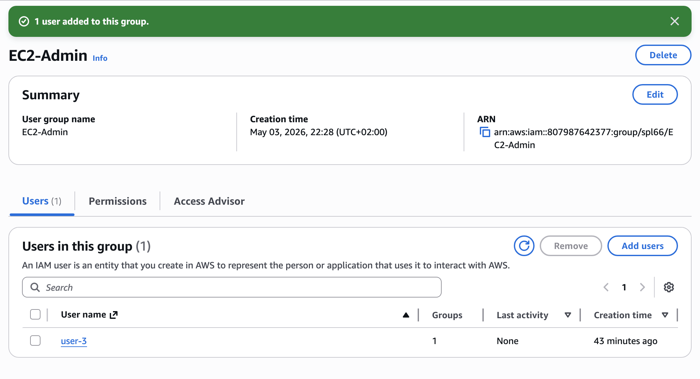
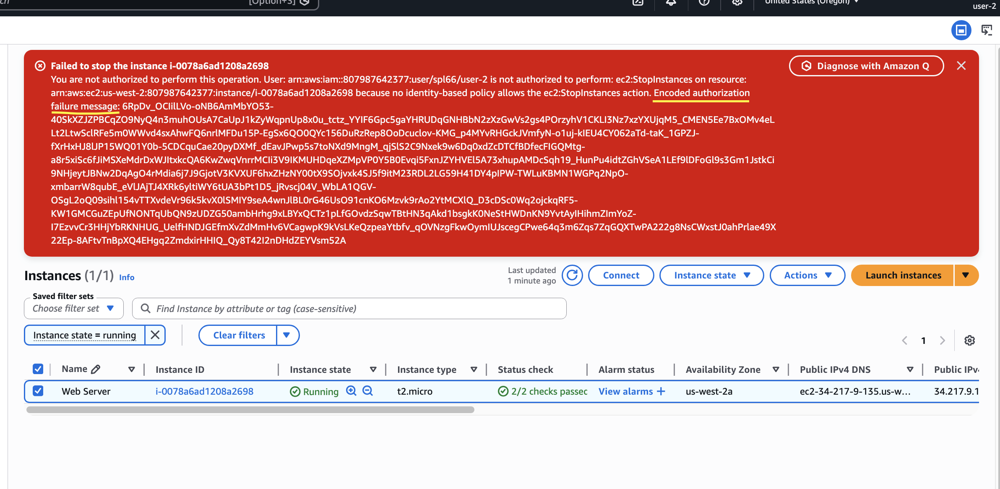
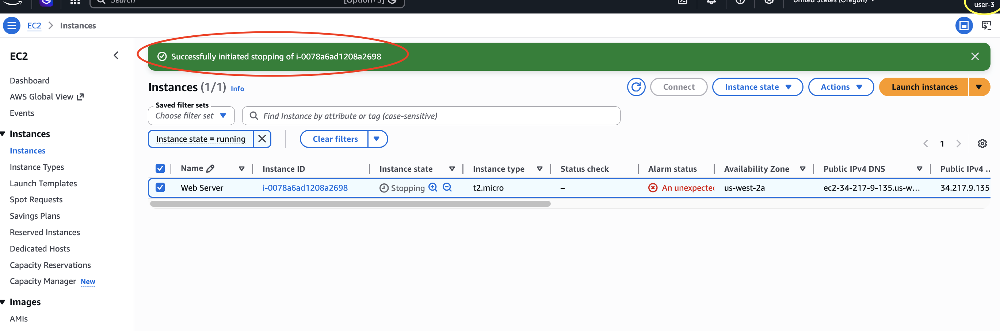

## **Project Description: Cloud Identity & Access Governance**

In modern enterprise environments, securing a network requires more than just a single login. Without proper authentication procedures and granular access control, unauthorized users can easily exploit critical network resources, including shared folders, intranets, and hardware devices. This project focuses on implementing **AWS Identity and Access Management (IAM)** to manage users, groups, and permissions, ensuring a secure and audited cloud infrastructure.

---

## **Project Objectives**

The primary goal is to transition from a broad access model to a structured, role-based security posture by achieving the following:
*   **Creating and applying** a customized IAM password policy to harden account security.
*   **Exploring** pre-created IAM identities and their organizational structures.
*   **Inspecting** JSON-based IAM policies to understand the specific permissions applied to support roles.
*   **Managing Group Membership** by assigning users to specific functional groups.
*   **Establishing** secure access routes via the unique IAM sign-in URL.
*   **Validating** security configurations by experimenting with the real-world effects of policies on service access.

---

## **AWS Services Utilized**

*   **IAM (Identity and Access Management)**: The core service used to manage users, roles, and federated identities, providing fine-grained control over AWS API operations.
*   **Amazon EC2 (Elastic Compute Cloud)**: Virtual servers used to test administrative and support-level permissions (View, Start, Stop).
*   **Amazon S3 (Simple Storage Service)**: Scalable object storage used to verify "Read-Only" vs. "Write" access constraints.
*   **Other Integrated Services**: Visibility into **Amazon CloudWatch**, **Elastic Load Balancing (ELB)**, and **EC2 Auto Scaling** for support-tier auditing.

---

## **Existing Environment**

The initial architecture consists of a decentralized identity pool and specialized support groups. Each group is mapped to a specific policy that dictates the "Effect," "Action," and "Resource" allowed for the associated users.

### **Initial Configuration Summary**

| Entity Type | Name | Associated Policy / Role |
| :--- | :--- | :--- |
| **IAM Users** | user-1, user-2, user-3 | Initial identities requiring group assignment. |
| **User Group** | **EC2-Admin** | Permissions to View, Start, and Stop EC2 instances. |
| **User Group** | **EC2-Support** | `AmazonEC2ReadOnlyAccess` for system auditing. |
| **User Group** | **S3-Support** | `AmazonS3ReadOnlyAccess` for data visibility without modification rights. |

---
## **Step 1: Account Security Hardening (Password Policy Management)**

This initial step focuses on establishing a robust security baseline for the AWS account. By transitioning from the default settings to a custom password policy, the account's authentication layer is hardened against unauthorized access and brute-force attempts.

---

### **IAM Password Policy Configuration**
The password policy was updated to meet strict corporate security requirements, ensuring that all IAM users associated with the account adhere to high-entropy credential standards.

| Requirement | Configuration | Objective |
| :--- | :--- | :--- |
| **Minimum Length** | 10 Characters | Increases complexity and the time required for a successful brute-force attack. |
| **Character Diversity** | All Character Types Enabled | Mandates a mix of uppercase, lowercase, numbers, and symbols to maximize entropy. |
| **Password Expiration** | 90 Days | Reduces the risk window if credentials are unknowingly compromised. |
| **Prevention of Reuse** | 5 Previous Passwords | Prevents users from alternating between the same few passwords, encouraging unique secrets. |
| **Administrator Reset** | Not Required | Balances security with operational efficiency by allowing users to rotate expired passwords independently. |

---

## **Step 2: Identity Audit & Group Infrastructure Exploration**

This stage involves a comprehensive audit of the pre-provisioned IAM environment. By analyzing the relationship between **Users**, **Groups**, and **Policies**, we define the operational boundaries for different organizational roles before active deployment begins.

---

### **IAM Identity Inventory**
The environment initializes with three distinct user accounts and three functional groups. An initial audit revealed that individual users (such as **user-1**) possess no inherent permissions or group memberships, adhering to the "Zero Trust" baseline.

*   **User Baseline**: Initial inspection of **user-1** confirmed a complete lack of permissions. Attempts to access services like **EC2** or **S3** result in immediate API authorization failures.
*   **Group Methodology**: Permissions are managed at the group level rather than per user. This centralized approach ensures that any policy updates are propagated instantly to all group members, maximizing administrative efficiency.

---

### **Policy Architecture Analysis**
The environment utilizes two distinct types of IAM policies to control access: **AWS Managed Policies** and **Customer Inline Policies**.

#### **1. Managed Policies (Standardized Support)**
The Support groups utilize AWS Managed Policies, which are pre-built, scalable templates.
*   **EC2-Support Group**: Attached to `AmazonEC2ReadOnlyAccess`.
    *   **Scope**: Grants `Describe` and `List` permissions for EC2, ELB, and CloudWatch.
    *   **Constraint**: Explicitly prevents any "Write" actions (Start/Stop/Terminate).
 

*   **S3-Support Group**: Attached to `AmazonS3ReadOnlyAccess`.
    *   **Scope**: Permits `Get` and `List` operations across all S3 buckets.
 

#### **2. Customer Inline Policies (Specialized Administrative Access)**
The **EC2-Admin** group utilizes a **Customer Inline Policy**. Unlike managed policies, these are embedded directly into a single identity for highly specific "one-off" requirements.
*   **EC2-Admin-Policy**: Grants the ability to not only view environment data but also perform lifecycle operations (**Start** and **Stop**) on EC2 instances.

---

### **Permissions Logic (JSON Structure)**
Every policy follows a standardized JSON structure that dictates how AWS evaluates access requests:

*   **Effect**: Defines whether the result is an `Allow` or `Deny`.
*   **Action**: Specifies the exact API calls permitted (e.g., `ec2:StartInstances`).
*   **Resource**: Defines the target. The use of a wildcard (`*`) indicates the permission applies to all resources of that type in the account.

---

> **Operational Insight:** The distinction between **Managed** and **Inline** policies is critical for compliance. Managed policies provide a reliable, AWS-maintained standard, while Inline policies offer the surgical precision needed for specialized administrative roles like the **EC2-Admin** group.

---

> **Operational Insight:** Strengthening password policies is a critical component of **Identity Governance**. By enforcing periodic rotation and high complexity, the organization significantly mitigates the risk of credential-based breaches, which remain a primary vector for unauthorized cloud access.

---
## **Step 3: Operationalizing the Governance Model (Identity Mapping)**

This stage transitions the security architecture from static definitions to active deployment. By assigning individual users to specialized groups, we implement **Role-Based Access Control (RBAC)**, ensuring each identity inherits only the permissions necessary for their specific job function[cite: 1].

---

### **User-to-Group Assignment Matrix**
Each user was mapped to a functional group to activate the pre-configured policies (Managed and Inline)[cite: 1]. This ensures that permissions are inherited automatically, reducing the risk of manual configuration errors.

| User Identity | Target Group | Resulting Permission Set |
| :--- | :--- | :--- |
| **user-1** | **S3-Support** | Inherits `AmazonS3ReadOnlyAccess` for bucket and object visibility[cite: 1]. |
| **user-2** | **EC2-Support** | Inherits `AmazonEC2ReadOnlyAccess` for monitoring EC2 and ELB resources[cite: 1]. |
| **user-3** | **EC2-Admin** | Inherits the custom Inline Policy allowing **Start/Stop** operations on instances[cite: 1]. |

---

### **Verification of Group Membership**
The assignment was verified within the IAM console to confirm that the identity governance model was correctly applied across all departments.

*   **Group Population**: After assignment, the "Users" column for each group was validated to show exactly **1** member, confirming no users were left without a functional role.
*   **Administrative Activation**: Specifically for the **EC2-Admin** group, **user-3** was successfully added, granting them the unique administrative capabilities defined in the earlier inline policy audit.

---

### **Handling Transitional Authorization Errors**
During the assignment process, various "Not Authorized" or "API Error" messages may appear in the console. These are expected behaviors within the lab environment:
*   **Contextual Limits**: These errors are caused by the parent lab account's restricted permissions and do not interfere with the internal IAM configuration of the sub-account.
*   **Resolution**: These alerts are resolved once the specific user logs in through the dedicated IAM sign-in URL, which correctly scopes their session to their new group permissions.

---

> **Operational Insight:** This step completes the **Identity Lifecycle** for these accounts. By assigning permissions at the group level rather than the user level, we have built a scalable system. If the "S3-Support" team grows to 100 people, we simply add them to the group to grant them instant, audited access without editing a single individual policy.

---
## **Step 4: User Authentication & Policy Validation**

This final stage focuses on verifying the effectiveness of the **IAM Governance Model** by testing real-world access for each user identity. By logging in as different users, we confirm that permissions are correctly scoped and that unauthorized actions are systematically blocked by the AWS policy engine[cite: 1].

---

### **Testing Environment: IAM Sign-In Protocol**
To prevent session conflicts and ensure clean authentication, a dedicated **IAM Sign-In URL** (incorporating the unique 12-digit Account ID) was used within Private/Incognito browser windows[cite: 1].

---

### **Validation Results: Permission Enforcement**

The following tests were conducted to verify that the "Least Privilege" principle was successfully implemented across all functional roles.

#### **1. user-1 (S3-Support Role)**
*   **Target Access**: S3 Storage.
*   **Result**: Successfully browsed S3 buckets and contents.
*   **Restriction Test**: Attempted to access **EC2 Instances**.
*   **System Response**: Blocked with an **"Authorized to perform this operation"** error, confirming the user has zero visibility into compute resources.

#### **2. user-2 (EC2-Support Role)**
*   **Target Access**: EC2 Read-Only.
*   **Result**: Successfully viewed the running Web Server instance.
*   **Action Test**: Attempted to **Stop** the instance.
*   **System Response**: Triggered a **"Failed to stop the instance"** error message. This proves the policy allows viewing configurations but forbids lifecycle modifications.
*   **Cross-Service Test**: Attempted to view S3 buckets; access was denied.

#### **3. user-3 (EC2-Admin Role)**
*   **Target Access**: EC2 Administration (Inline Policy).
*   **Result**: Successfully viewed the EC2 instances.
*   **Action Test**: Attempted to **Stop** the instance.
*   **System Response**: **Successfully initiated stopping** of the instance. This confirms that the Customer Inline Policy correctly granted the specific permissions needed for infrastructure management.

---

### **Summary of Security Posture**

| User | Group | S3 Access | EC2 View | EC2 Modify |
| :--- | :--- | :---: | :---: | :---: |
| **user-1** | S3-Support | **Granted** | Denied | Denied |
| **user-2** | EC2-Support | Denied | **Granted** | Denied |
| **user-3** | EC2-Admin | Denied | **Granted** | **Granted** |

---

> **Operational Insight:** This lab successfully demonstrates the **Policy Evaluation Logic** of AWS. Every request made by the users was checked against their group policies in real-time. By utilizing **Managed Policies** for support and **Inline Policies** for admins, the organization maintains a secure environment where users have exactly the access they need to perform their jobs, and nothing more[cite: 1].
