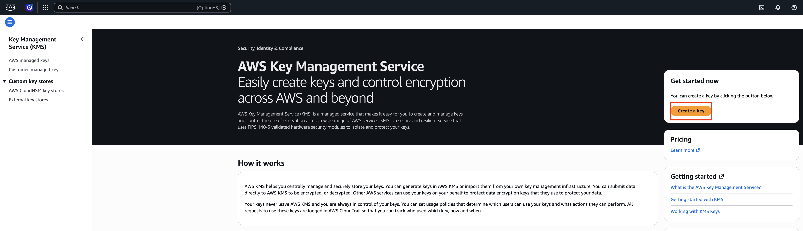
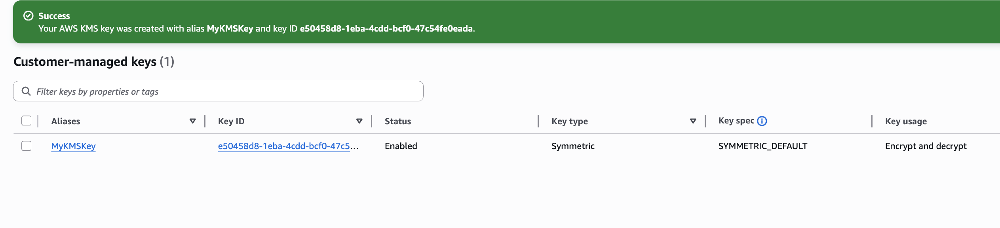
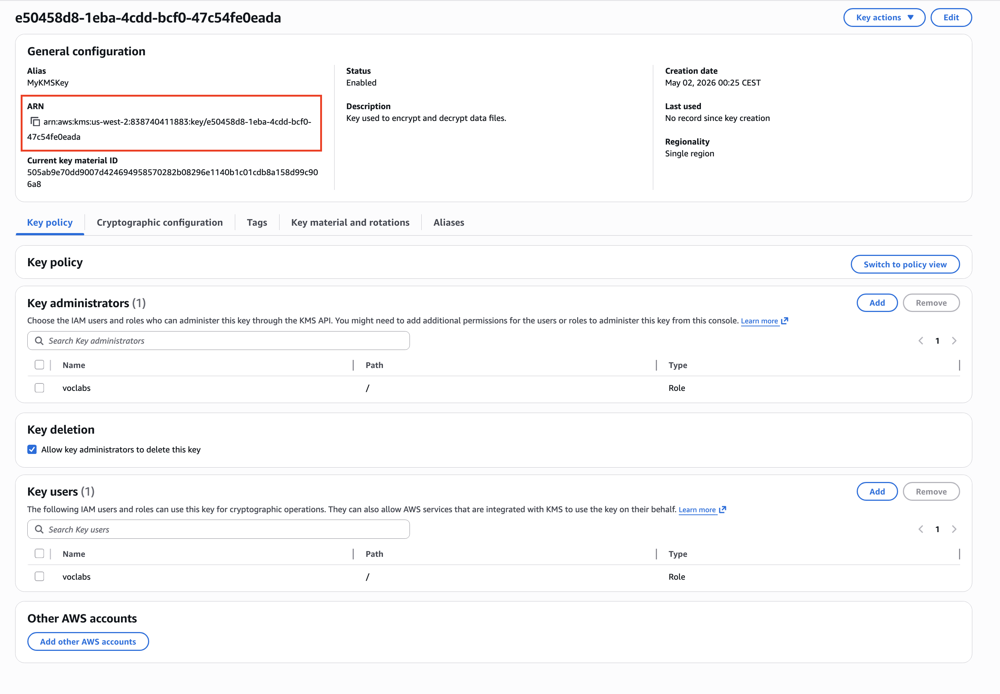
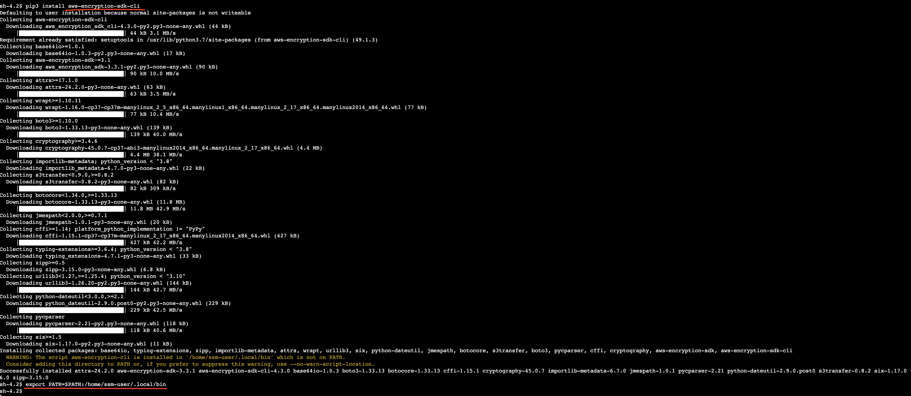
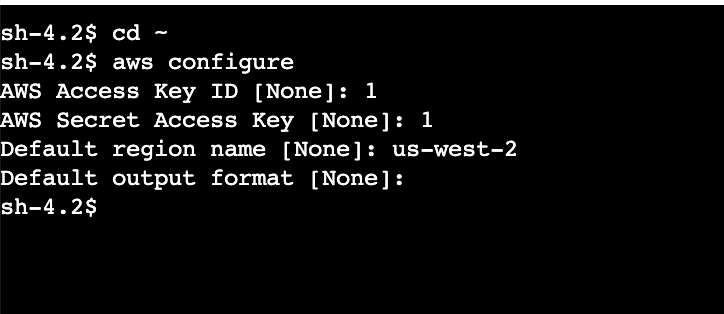
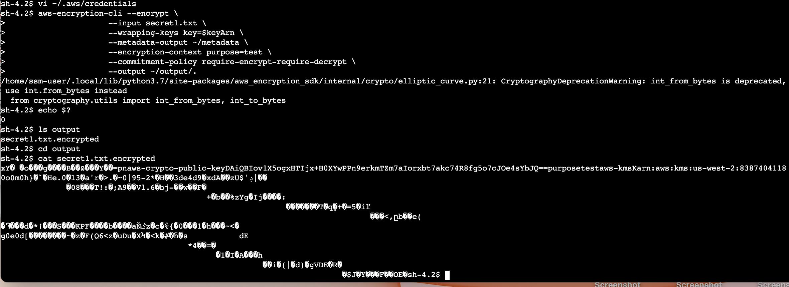
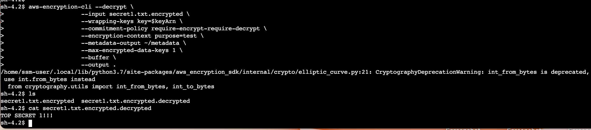
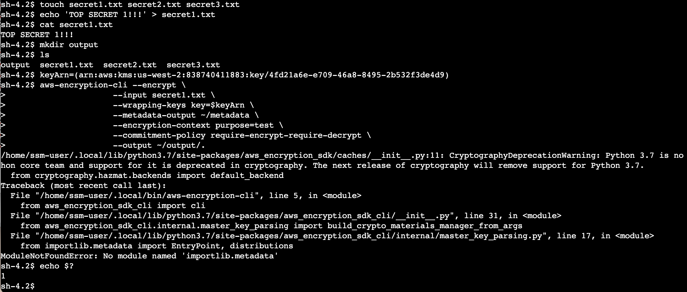
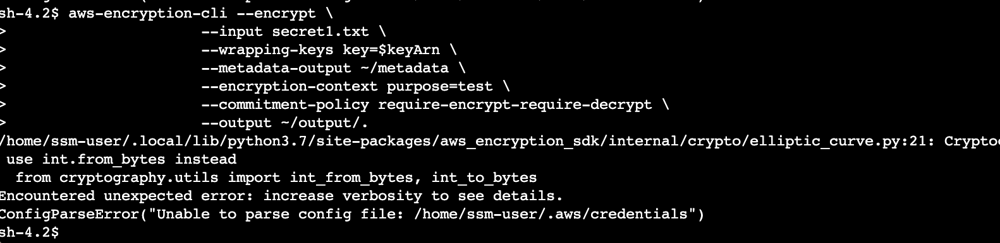

# Project: Data Protection and Cryptography with AWS KMS

## Overview
This project demonstrates the implementation of **Data Protection** by using cryptographic keys to secure sensitive information. It covers the end-to-end lifecycle of encryption: from generating a master key in **AWS KMS** to managing ciphertext on a remote server using the **AWS Encryption CLI**.

## **Prerequisites & Existing Environment**

To simulate a real-world enterprise scenario, this project was conducted within a pre-configured AWS environment. This ensures the focus remains on the encryption lifecycle rather than basic infrastructure setup.

### **The Starting Infrastructure**
*   **Pre-provisioned Compute:** The environment included a running **Amazon EC2** instance named **File Server**, which acted as our primary data workstation.
*   **Identity & Access Management (IAM):** A specialized IAM role was pre-attached to the instance. This role provided the "Identity" required for the server to securely request keys from **AWS KMS** and allowed management via **Systems Manager**.
*   **Networking & Security:** The instance was configured to be "private," meaning it had no public-facing SSH ports open. Instead, it relied on **SSM Session Manager** for secure, browser-based terminal access.

## **AWS Services & Tools Used**

This project leverages a "Security-First" tech stack to ensure data remains protected throughout its entire lifecycle—from creation to storage.

*   **AWS Key Management Service (KMS)**: Acted as the central "Key Vault" to create and manage the symmetric master keys used for encryption.
*   **Amazon EC2 (Elastic Compute Cloud)**: Provided the scalable virtual "File Server" environment where the sensitive data was stored and processed.
*   **AWS Systems Manager (SSM)**: Enabled secure, browser-based terminal access to the instance via **Session Manager**, ensuring no public SSH ports were exposed.
*   **AWS Identity and Access Management (IAM)**: Managed the granular permissions and roles that allowed the File Server to securely request encryption services from KMS.
*   **AWS Encryption CLI**: The primary tool used to perform the mathematical encryption and decryption of files directly on the server.

### **Service Evidence**
*   **KMS Management**: The master key was identified via its unique Amazon Resource Name (ARN).
*   **EC2 Infrastructure**: The hosting environment was a `t2.micro` instance running within a secure, managed subnet.
*   **Secure Access**: All administrative tasks were performed through a managed SSM session, providing a full audit trail of activity.

---

## **Step 1: Establishing a Root of Trust (AWS KMS)**

**AWS Key Management Service (KMS)** was used to generate a hardware-protected key to manage digital locks for sensitive data.This stage focused on provisioning a hardware-backed master key to manage the encryption lifecycle.

### **Key Infrastructure Specifications**
| Component | Implementation | Rationale |
| :--- | :--- | :--- |
| **Key Type** | Symmetric (AES-256) | Selected for high-performance encryption/decryption with minimal latency. |
| **Compliance** | FIPS 140-2 | Ensures keys are protected by validated hardware security modules (HSMs). |
| **Alias** | `MyKMSKey` | Assigned for simplified resource mapping and administrative tracking. |
| **IAM Policy** | Role-Based Access | Permissions restricted exclusively to the `voclabs` identity to enforce the Principle of Least Privilege. |

### **The Business Value:**
* **Hardware-Backed Security:** Using KMS ensures that keys are protected by hardware security modules (HSMs) that meet the **FIPS 140-2** federal standard.
* **Centralized Control:** This setup allows a company to centrally manage and audit the use of encryption keys across its entire AWS architecture.

----

## **Step 2: Environment Provisioning & Secure Management**

This stage focused on establishing a secure communication channel to the compute resources and provisioning the software required for cryptographic operations.

### **System Configuration & Identity Synchronization**
| Component | Implementation | Rationale |
| :--- | :--- | :--- |
| **Access Strategy** | SSM Session Manager | Utilized for secure, browser-based terminal access, eliminating the need to manage SSH keys or expose Port 22. |
| **Identity Management** | AWS CLI Configuration | Synchronized local credentials (`~/.aws/credentials`) to authorize the instance to perform KMS actions. |
| **Software Layer** | AWS Encryption SDK | Deployed the `aws-encryption-sdk-cli` via `pip3` to provide the server with standardized cryptographic libraries. |
| **Environment Pathing** | Shell PATH Export | Extended the system PATH to ensure the encryption tool is globally executable across the shell environment. |

> **Operational Insight:** By leveraging **SSM Session Manager** and local pathing, the environment maintains a "Zero-Open-Port" policy. This minimizes the attack surface while ensuring the server is fully operational for data protection tasks.

---

## **Step 3: Data Protection Lifecycle (Encryption & Decryption)**

This final stage demonstrates the practical application of the cryptographic infrastructure by securing sensitive data at rest and verifying the ability to restore it for authorized use.

### **Data Creation & Workspace Preparation**
To simulate a real-world workload, a set of sensitive files was generated. This establishes the "plaintext" baseline—data that is currently unencrypted and vulnerable to unauthorized access.

*   **Asset Creation**: A mock sensitive file, `secret1.txt`, was initialized with the high-value string "TOP SECRET 1!!!".
*   **Logical Partitioning**: A dedicated `output` directory was created to store processed cryptographic assets, keeping protected data isolated from raw source files.

### **Securing Assets: Plaintext to Ciphertext**
Using the **AWS Encryption CLI** and the pre-provisioned **KMS Master Key**, the plaintext was transformed into an unreadable state. This ensures that even if the storage medium is compromised, the data remains confidential.

*   **The Encryption Command**: The operation utilized several advanced security parameters:
    *   `--wrapping-keys`: Targeted the specific KMS ARN to manage the data keys.
    *   `--encryption-context`: Added non-secret security metadata (`purpose=test`) to provide additional integrity checks during decryption.
    *   `--commitment-policy`: Enforced key commitment, ensuring the ciphertext is bound to the specific key used during encryption.
*   **Verification**: The system exit code (`$?`) returned `0`, confirming a successful operation. Inspecting the resulting `.encrypted` file showed that the contents were completely obfuscated into ciphertext.

### **Data Restoration: Ciphertext to Plaintext**
To verify the full lifecycle, the process was reversed. The system authenticated with KMS to unlock the data and restore its original readability.

*   **The Decryption Command**: The CLI referenced the same KMS key and encryption context to prove authorization. The `--max-encrypted-data-keys` parameter was set as a security guardrail to ensure only the expected number of keys were involved in the process.
*   **Integrity Confirmation**: The final `cat` command on the decrypted output perfectly matched the original source data, confirming that the encryption process maintained 100% data integrity.

> **Operational Insight:** This workflow proves that by integrating KMS with standardized CLI tools, a business can implement high-strength, scalable data protection that satisfies strict compliance requirements (such as SOC2 or HIPAA) while remaining accessible to authorized automated processes.
---
## **Technical Log: Resolving Version Dependency Conflicts**

During the provisioning of the **AWS Encryption CLI**, a critical environment mismatch was identified between the server’s runtime and the software’s library requirements. This section logs the identification and resolution of that conflict.

---

### **Issue Identification**
Upon executing the `aws-encryption-cli`, the system triggered a `ModuleNotFoundError`. 

*   **Error Traceback**: `ModuleNotFoundError: No module named 'importlib.metadata'`
*   **Root Cause Analysis**: The File Server was running **Python 3.7**. The latest version of the AWS Encryption SDK (v4.0+) requires **Python 3.8 or higher** to support the `importlib.metadata` library for entry-point discovery.

---

### **Resolution Strategy: Version Pinning**
To maintain compatibility with the existing server environment without performing a high-risk OS-level Python upgrade, a **Version Pinning** strategy was implemented.

*   **Action**: The installation command was modified to target a legacy-compatible version of the SDK.
*   **Command**: `pip3 install "aws-encryption-sdk-cli<4.0"`
*   **Result**: This successfully installed the 3.x branch of the CLI, which is fully compatible with Python 3.7 while maintaining all required cryptographic functionality for the project.

---

> **Operational Insight:** This incident highlights the importance of **Environment Parity**. In a production CI/CD pipeline, this issue would be mitigated by using **Docker containers** or **Virtual Environments (venv)** to isolate software dependencies from the host OS version.
---

**End of Log**
---
[← Back to Main Portfolio](../../)
