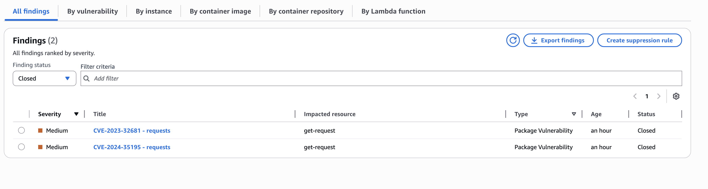
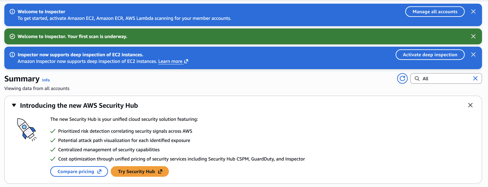
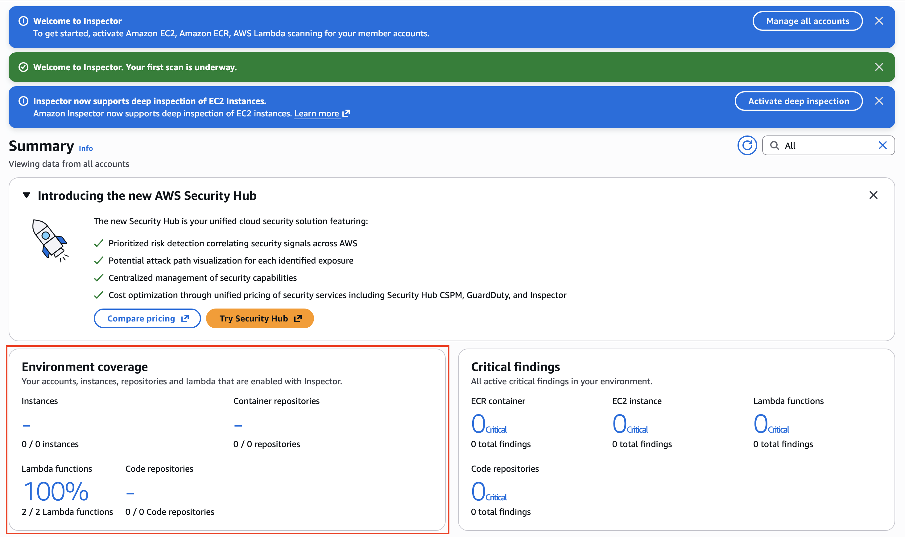
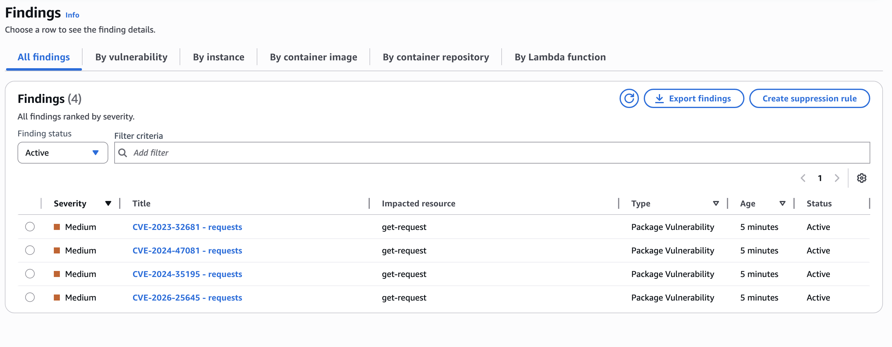
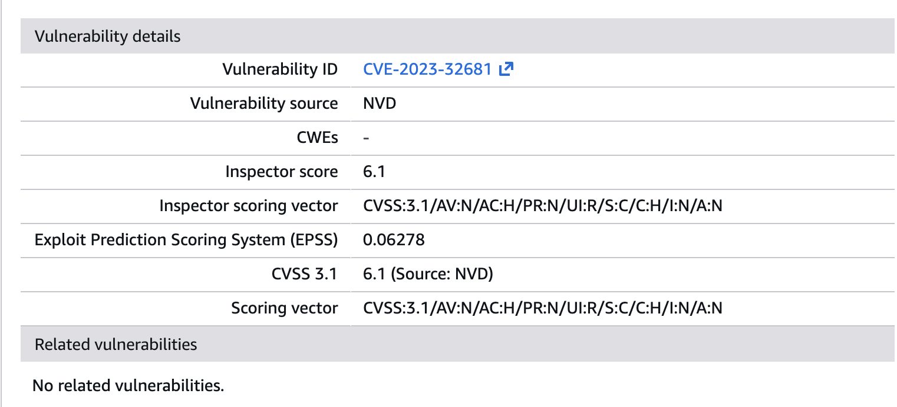
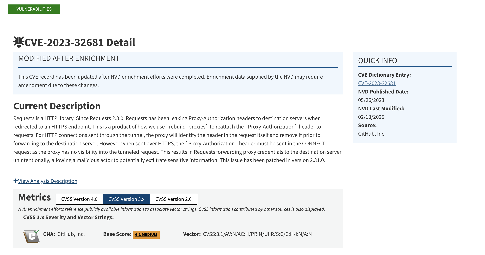
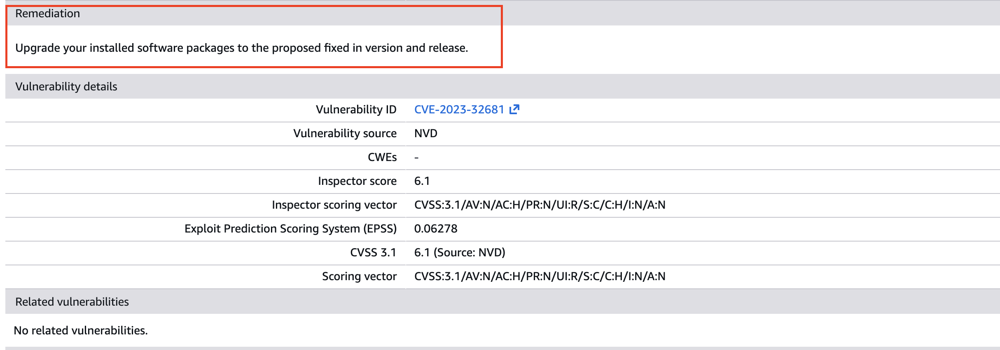
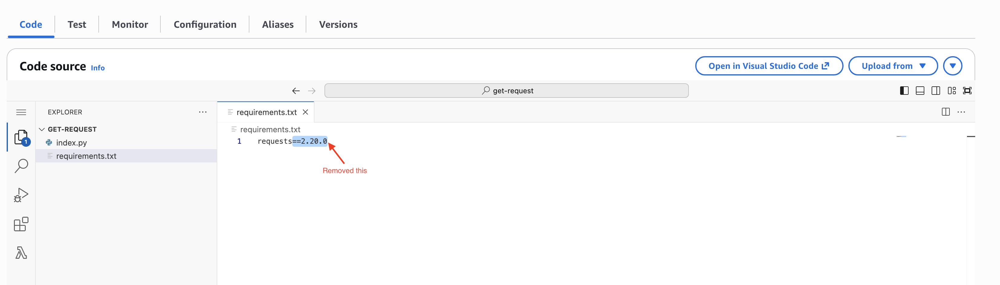
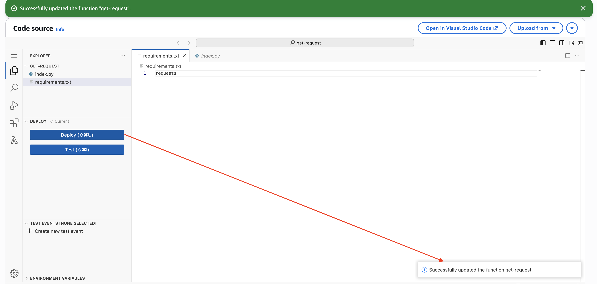
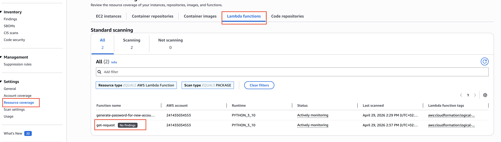

# Project: Automated Vulnerability Management with Amazon Inspector

## Overview
This project demonstrates the implementation of **Amazon Inspector** to automate security assessments for a serverless application architecture. The focus is on providing continuous, automated vulnerability scanning for **AWS Lambda** functions to identify software package flaws and code-level security risks during the development lifecycle.

## Project Objectives
* **Activate and Configure:** Enable Amazon Inspector to perform automated resource discovery and scanning.
* **Analyze Findings:** Interpret vulnerability reports and prioritize risks based on severity (CVSS).
* **Remediate Risks:** Apply security fixes to resolve identified vulnerabilities in Lambda function code and dependencies.

---

## AWS Services In this project
* **Amazon Inspector:** The primary tool used for automated vulnerability management.
* **AWS Lambda:** The target serverless compute resources being scanned.
* **IAM (Identity and Access Management):** Used to provide the necessary permissions for automated scanning.

## **Project Prerequisites & Existing Environment**

Before activating the security tools, it is important to understand the starting state of the infrastructure. [cite_start]This project uses an environment that mimics a real company in the early stages of building an application[cite: 89, 154, 160].

### **The Starting Environment**
* **Pre-deployed Resources:** Two **AWS Lambda** functions (small pieces of application code) have already been created by the development team.
* **Security Need:** Because these functions contain custom code and external software libraries, they require a professional audit to ensure they do not have any "backdoors" or weaknesses[cite: 154].

---

## Project Phases
* **Phase 1: Activation of Amazon Inspector & Vulnerability Discovery**
* **Phase 2: Investigating a Specific Security Finding (Example Case Study)**
* **Phase 3: Fixing the Vulnerabilities (Remediation & Verification)**

---

## **Phase 1: Activation of Amazon Inspector & Vulnerability Discovery**

This phase involves turning on the "automatic security guard" for the account. Once active, the service begins a non-stop search for weaknesses (vulnerabilities) within the digital infrastructure.

### **What was done:**
* **Activating the Service:** Amazon Inspector was turned on to begin protecting the account and its resources immediately.
* **Automatic Scanning:** The tool automatically discovered and started checking **AWS Lambda** functions (the small "engines" that run application code).

* **Full Visibility:** The dashboard was monitored until the **Environment Coverage** reached **100%**, ensuring that every part of the system was being watched and nothing was left unprotected.

  
* **Identifying Risks:** The scan successfully uncovered three security issues, providing key details like the **Severity** (how dangerous it is) and the **Impacted Resource** (which part of the business is at risk).

### **The Business Logic (Why this matters):**
* **Continuous Safety:** Instead of a one-time check, this provides **Continuous Scanning**. It is like having a security guard who never sleeps and immediately notices if a new "door" is left unlocked as the business grows.
* **Data-Driven Decisions:** By linking findings to the **National Vulnerability Database (NVD)**—a standard list of known threats maintained by **NIST**—the business can make decisions based on global security intelligence rather than guesswork.
* **Clear Roadmap for Fixes:** Each finding includes a **Remediation** section, which tells the team exactly how to fix the problem, such as upgrading an outdated software package like `requests`.

## **Phase 2: Investigating a Specific Security Finding (Example Case Study)**

Once the scan is complete, the project moves to analyzing specific "Red Flags" or findings. This example shows the process of researching a security risk to understand how it affects the business.

### **The Investigation: CVE-2023-32681**
* **Identifying the Risk:** The scan discovered three specific security issues within the **AWS Lambda** functions. One specific finding was labeled **CVE-2023-32681**, which was categorized as a **Medium** severity risk.
* **Technical Root Cause:** The research confirmed that the `requests` software package used by the application is vulnerable and outdated.

* **Global Research (NVD):** To understand the threat, the project utilizes an external link to the **National Vulnerability Database (NVD)**. This is a global "library of threats" maintained by **NIST** (National Institute of Standards and Technology).

### **The Solution (Remediation)**
* **Recommended Action:** The system provides a clear **Remediation** path: upgrade the `requests` package to a newer, secure version.

  
### **The Business Logic (Why this matters):**
* **Informed Decisions:** Linking AWS findings to the **NVD** ensures the business is using standardized, global data to prioritize its security work.
* **Efficiency:** Instead of a developer spending hours researching why a connection might be weak, the tool identifies the exact package that needs an upgrade, saving time and reducing costs.
---
## **Phase 3: Fixing the Vulnerabilities (Remediation & Verification)**

Once a security risk is identified, the next step is to "patch" it. This phase shows how the business can quickly update its software to stay protected against known threats.

### **What was done:**
* **Locating the Problem:** The **get-request** function was identified as the source of the security alert.
* **Updating the Code:** Inside the code editor, the **requirements.txt** file was modified.
* **Removing the Weak Link:** The specific, outdated version of the software (`requests==2.20.0`) was removed and replaced with a general request for the latest version.

* **Deploying the Fix:** The new configuration was saved and deployed to the cloud environment.

* **Automated Verification:** The deployment automatically triggered **Amazon Inspector** to re-scan the code.
* **Confirming Safety:** The dashboard confirmed the vulnerability (**CVE-2023-32681**) moved from "Active" to **"Closed"** status.
* **Timestamp Audit:** The **Resource Coverage** page showed a fresh timestamp, proving the system is now "Actively monitoring" a clean environment.

### **The Business Logic (Why this matters):**
* **Auto-Correction:** By removing the specific version number, the application now automatically pulls the newest, safest version of the software. This reduces the need for manual updates in the future.
* **Closed-Loop Security:** The fact that the alert moved to "Closed" automatically gives the business a verified "paper trail" showing that the risk has been eliminated.
* **Zero Downtime Security:** The fix was applied and verified without taking the application offline, showing that high security can be achieved without interrupting the business.

### **The Result:**
The environment is now at **100% coverage** with **Zero Active Findings**, meaning the business is running on a secure, modern software foundation.

### **End of Log**

---
