# Project: Fleet-Wide Software Patching with AWS Systems Manager

## Overview
This project addresses the logistical challenge of keeping software up to date in organizations with hundreds or thousands of workstations. By using **AWS Systems Manager Patch Manager**, this project demonstrates how to automate the deployment of security updates across a large fleet of servers to maintain a consistent security baseline.

---

## **Project Prerequisites & Existing Environment**
To simulate a real-world enterprise environment, the project starts with a pre-configured infrastructure.

### **The Starting Environment**
* **Server Fleet:** The environment consists of six **Amazon EC2** instances.
* **Operating Systems:** The fleet is divided into three **Linux** instances and three **Windows** instances to test cross-platform management.
* **Backend Support:** Essential components like **IAM roles** (permissions) and service connections were pre-built to ensure the automation tools could communicate with the servers.

# Phase 1: Patching Linux Instances using Default Security Standards

This phase demonstrates how to use automated "standard rules" (baselines) to update a group of Linux servers all at once. This ensures that every server meets the company's minimum security requirements without manual work on each machine.

## **Step 1: Fleet Discovery and Management**
Before updating, the project uses **Fleet Manager** to get a "Bird's Eye View" of every server in the company. 

* **The Fleet:** The dashboard shows six active **Managed Nodes** (3 Linux and 3 Windows servers).
* **Connectivity:** Every server shows a "Ping Status" of **Online**, meaning they are ready to receive updates.

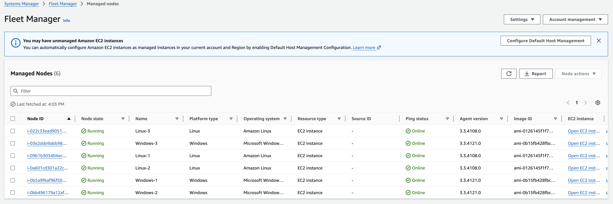

## **Step 2: Verifying Server Identity**
To ensure the correct security rules are applied, a deep-dive into an individual server (**Linux-1**) was performed.

* **Platform Verification:** The server is confirmed as an **Amazon Linux** instance.
* **The "Permission Slip" (IAM Role):** The server has a specific **IAM Role** attached. This acts like a digital ID card that allows **AWS Systems Manager** to safely enter the server and install updates.

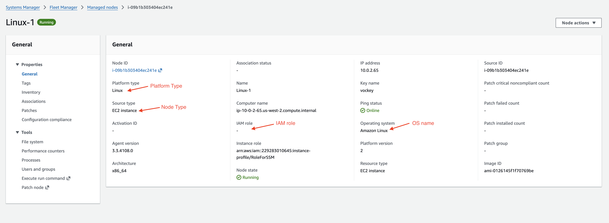

## **Step 3: Initiating the Automated Patching**
The project utilizes the **Patch Manager** tool to begin the update process across the entire organization.

* **The Overview:** The command center provides a "Patch Now" feature for quick security fixes.

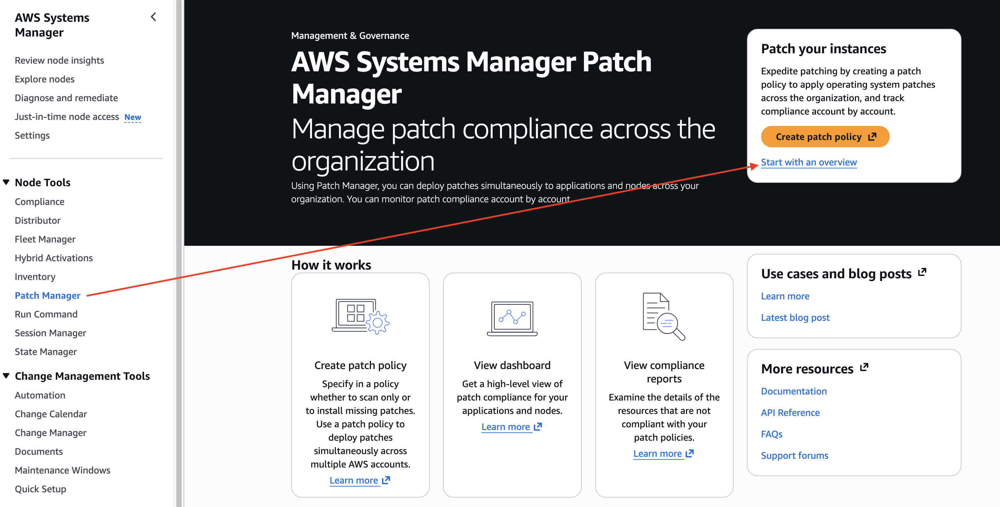

* **The Rule Book (Baseline):** For this task, the **AWS-AmazonLinux2DefaultPatchBaseline** was used. This is a pre-configured set of security rules provided by AWS that covers standard Linux vulnerabilities.

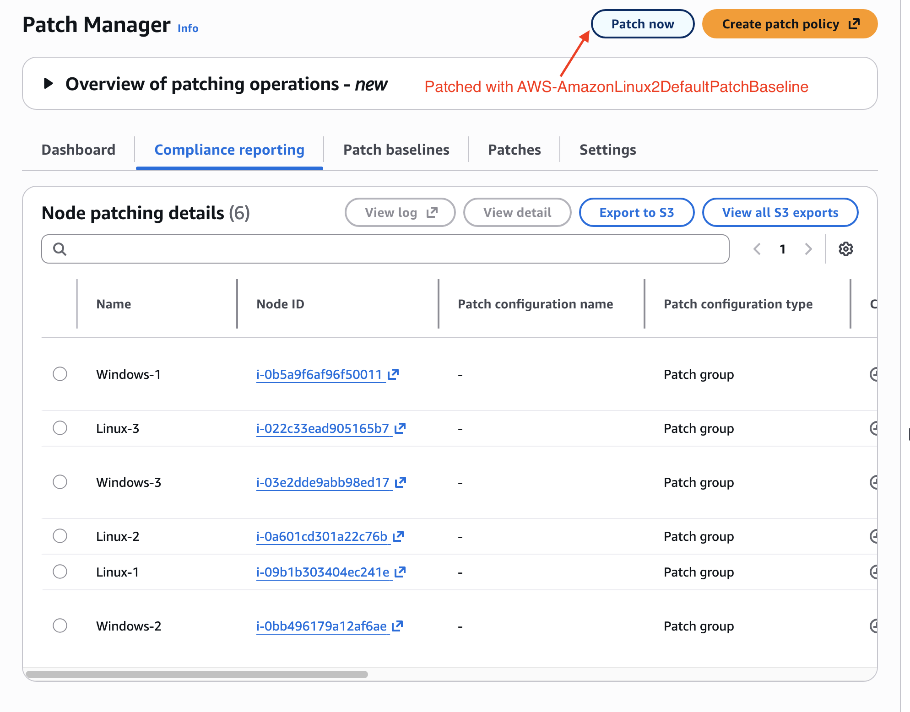

---

## **Step 4: Targeted Execution and Monitoring**
To stay organized, the project doesn't just update everything at once. It uses **Tags** to target a specific "Patch Group."

Before executing the update, specific settings were chosen to balance security needs with system stability. This "Scan and Install" strategy ensures the environment is corrected immediately while minimizing impact on business operations.

### **Configuration Breakdown**

| Setting | Choice | Business Logic (The "Why") |
| :--- | :--- | :--- |
| **Patching Operation** | **Scan and Install** | Instead of just finding problems (Scanning), this option immediately fixes them (Installing). This provides a complete, one-step solution to security gaps. |
| **Reboot Option** | **Reboot if needed** | Some security updates require a restart to take effect. This setting allows the system to restart only if it is absolutely necessary, avoiding unnecessary downtime for the business. |
| **Target Selection** | **Specify Instance Tags** | This is a "Surgical" approach to management. By targeting specific tags, we ensure that only the intended servers are updated, preventing accidental changes to other departments or test environments. |
| **Tag Key/Value** | **Patch Group: LinuxProd** | This specific label identifies our "Linux Production" fleet. It allows us to manage these servers as a single group rather than individual machines. |

* **Visual Progress:** A real-time dashboard provides a pie chart to track the success of the operation. As the "Succeeded" section grows, it confirms the servers are now secure.

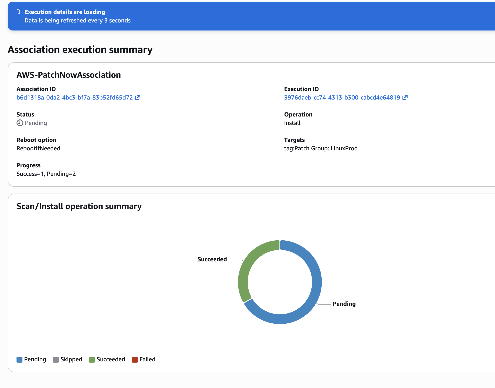

* **Visual Confirmation:** The **Scan/Install operation summary** chart is now entirely green, indicating a 100% success rate for the operation.

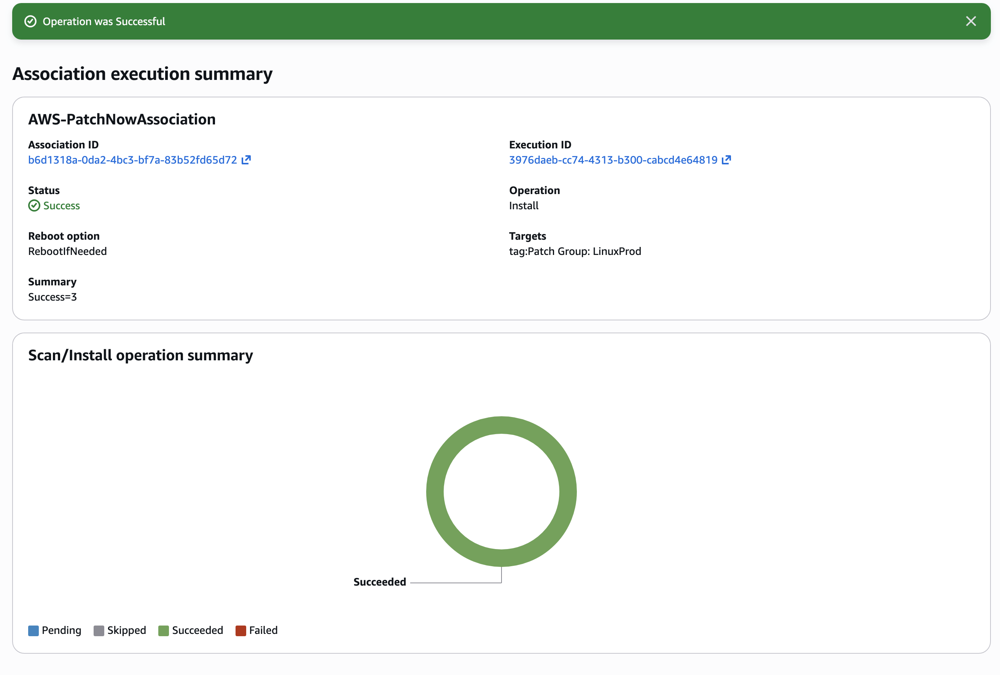

### **The Business Logic (Why this matters):**
* **Precision Targeting:** Using **Tags** means the business can scale to thousands of servers and still target them with 100% accuracy based on their role (e.g., Accounting, Web, or Database).
* **Automated Remediation:** By choosing **Scan and Install**, we remove the human delay between finding a weakness and fixing it, significantly reducing the "window of risk."
* **Smart Downtime:** The **Reboot if needed** logic ensures that we don't restart servers unless the update requires it, maintaining high availability for company services.

---

## **Phase 2: Customizing Security for Windows (Custom Baselines)**

While default rules are effective for general use, specialized environments like Windows servers often require more granular control. This phase demonstrates how to create a custom "Security Rulebook" (Patch Baseline) tailored specifically for Windows Server 2019.

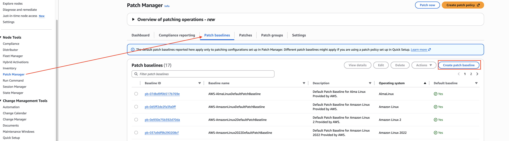

### **What was done:**
* **Defining the Rules:** A new baseline named **WindowsServerSecurityUpdates** was created. 
* **Prioritizing Security:** Approval rules were established to automatically authorize **Critical** and **Important** security updates for **WindowsServer2019** after a 3-day buffer period.

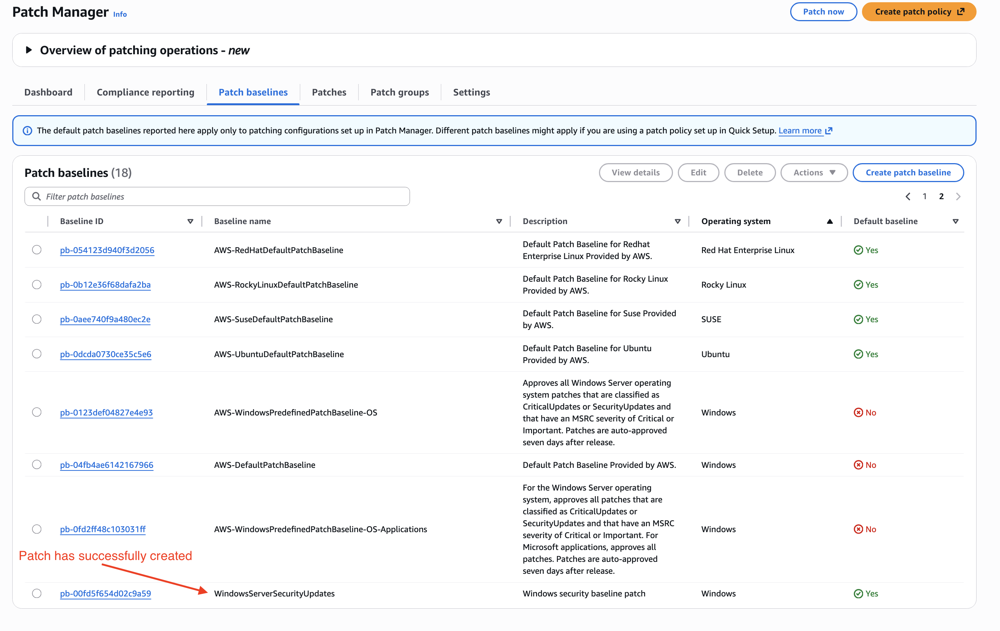

* **Organizing by Role:** The baseline was associated with a **Patch Group** called **WindowsProd** to ensure these rules only apply to production-ready servers.

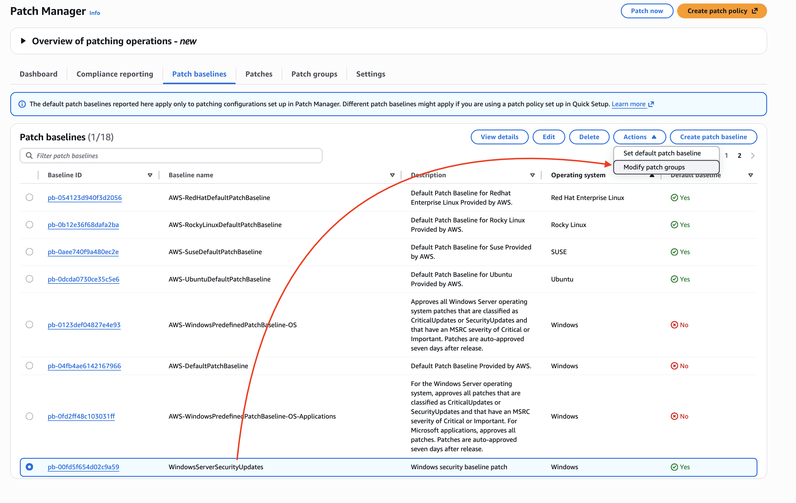

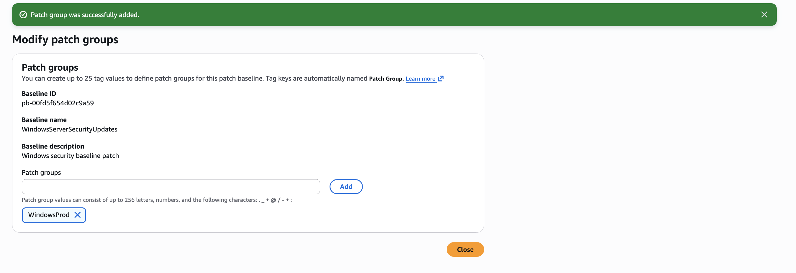

### **The Business Logic (Why this matters):**
* **Risk Mitigation:** Focusing on "Critical" and "Important" classifications ensures the most dangerous vulnerabilities are addressed first.
* **Stability:** The 3-day auto-approval delay provides a safety window, ensuring that the business doesn't deploy a new patch that might have unforeseen bugs.

---

## **Phase 3: Connecting the Fleet (Tagging & Execution)**

To automate updates across a large environment, servers must be "labeled" so the system knows which rules apply to which machine. This is achieved through **Tags**.

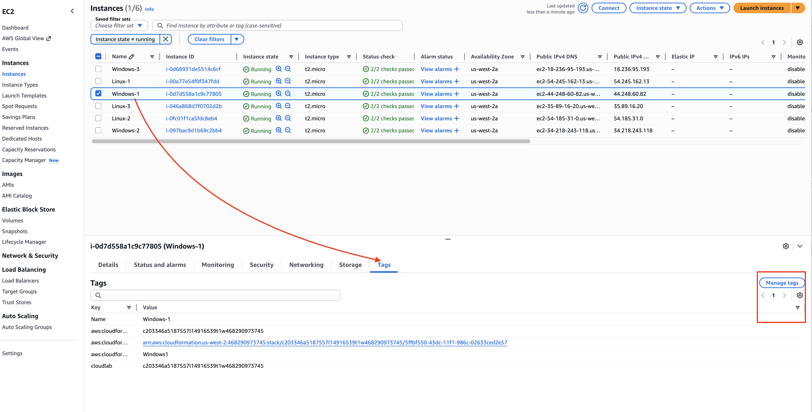

### **What was done:**
* **Labeling the Servers:** Each Windows instance was tagged with the key **Patch Group** and the value **WindowsProd**.
* **Automated Execution:** The **Patch Now** feature was used to target only those instances with the **WindowsProd** tag.

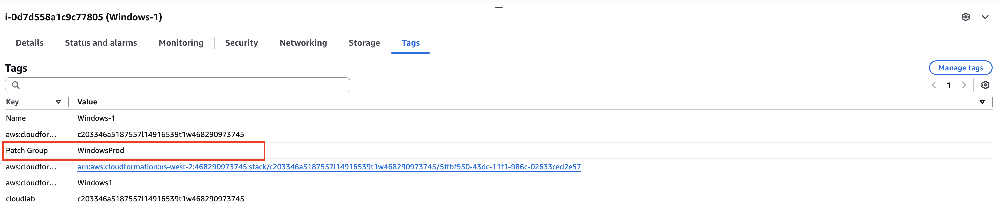

* **Technical Orchestration:** Behind the scenes, Patch Manager uses the **Run Command** to execute the **RunPatchBaseline** document, which evaluates and installs the necessary patches.
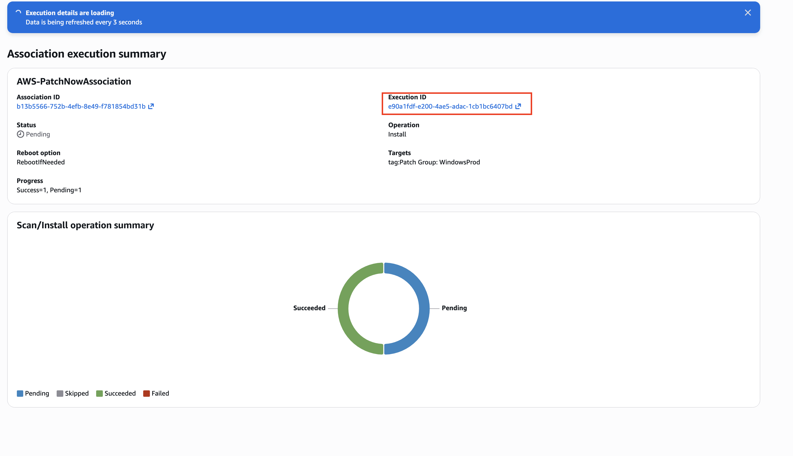

### **The Business Logic (Why this matters):**
* **Precision Targeting:** Using tags allows the business to scale to thousands of servers while maintaining 100% accuracy in which updates are sent to which department.
* **Automated Logging:** The system generates a detailed **Output** log for every instance, providing an unalterable record of the update process.

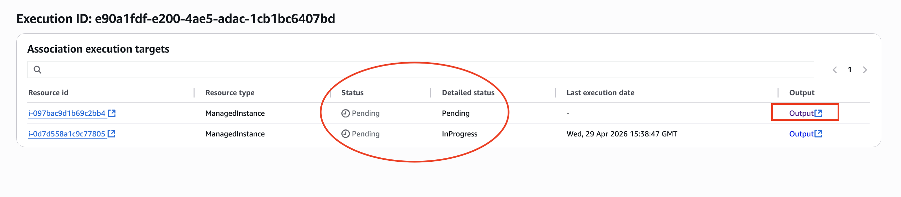

---

## **Phase 4: Final Audit & Compliance Verification**

The project concludes by verifying that every server in the organization meets the required security standards.

### **What was done:**
* **Fleet-Wide Verification:** The **Compliance Reporting** dashboard confirmed that all 6 servers (3 Linux and 3 Windows) reached a status of **Compliant**.
* **Deep-Dive Audit:** The system allows for a review of specific patches applied to each node, including the exact installation time.

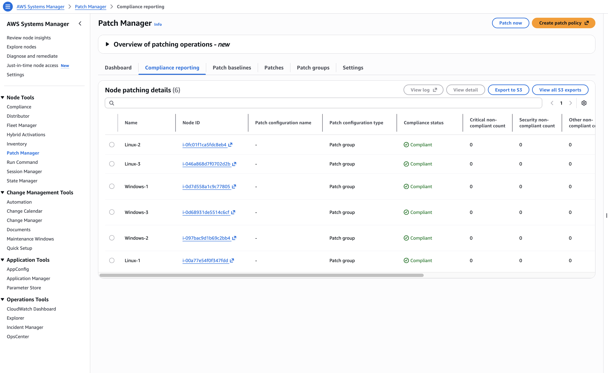

### **The Business Logic (The Final Result):**
* **100% Visibility:** Management has a single, real-time view confirming the entire infrastructure is healthy.
* **Regulatory Readiness:** This dashboard provides the necessary evidence for security audits, proving the organization is actively maintaining a secure environment.
* **Scale and Efficiency:** This automated workflow replaces hours of manual labor with a reliable, repeatable process.

---
**End of Log**
---
[← Back to Main Portfolio](../../)
